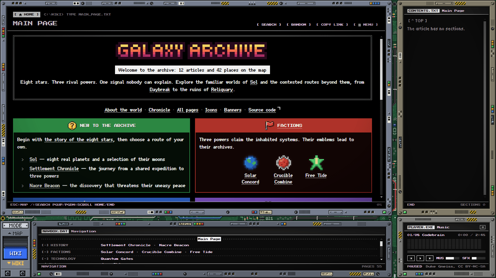
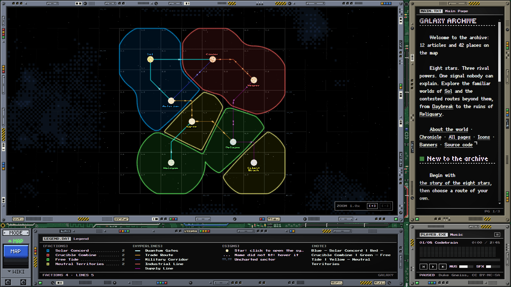
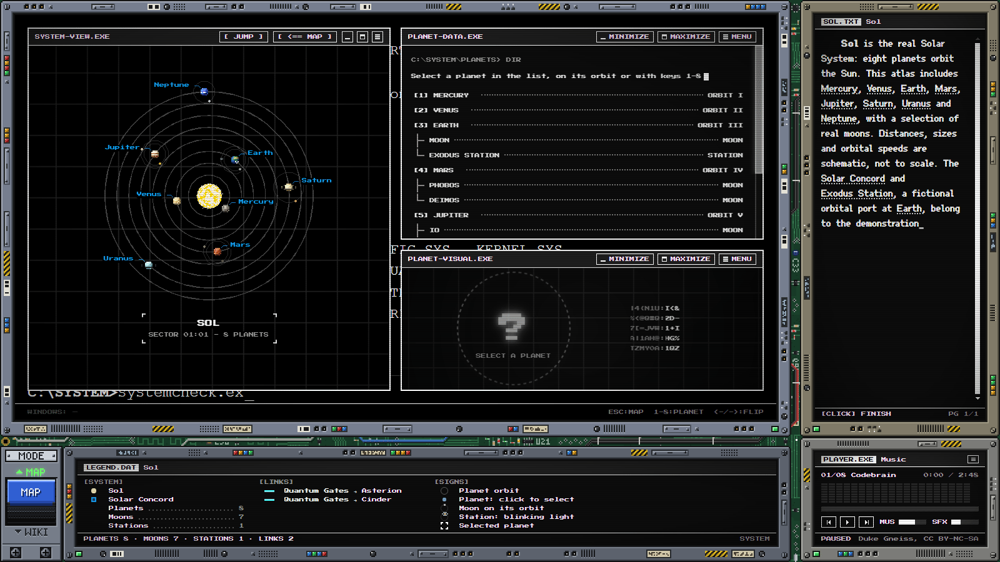
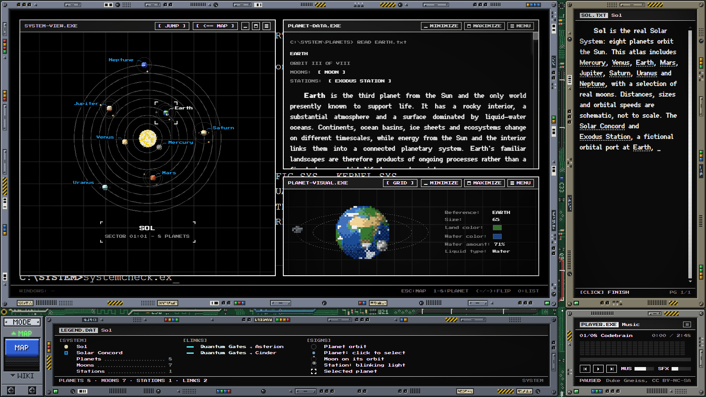
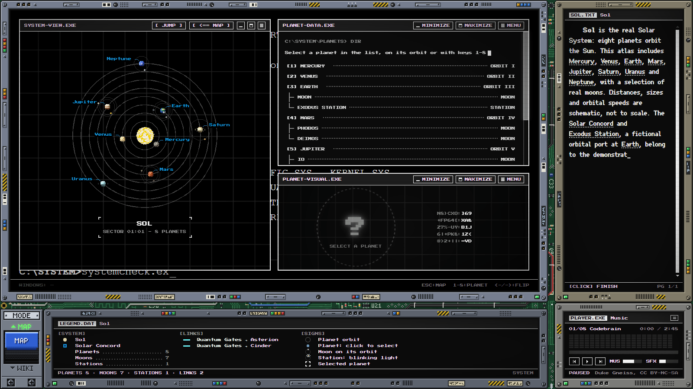
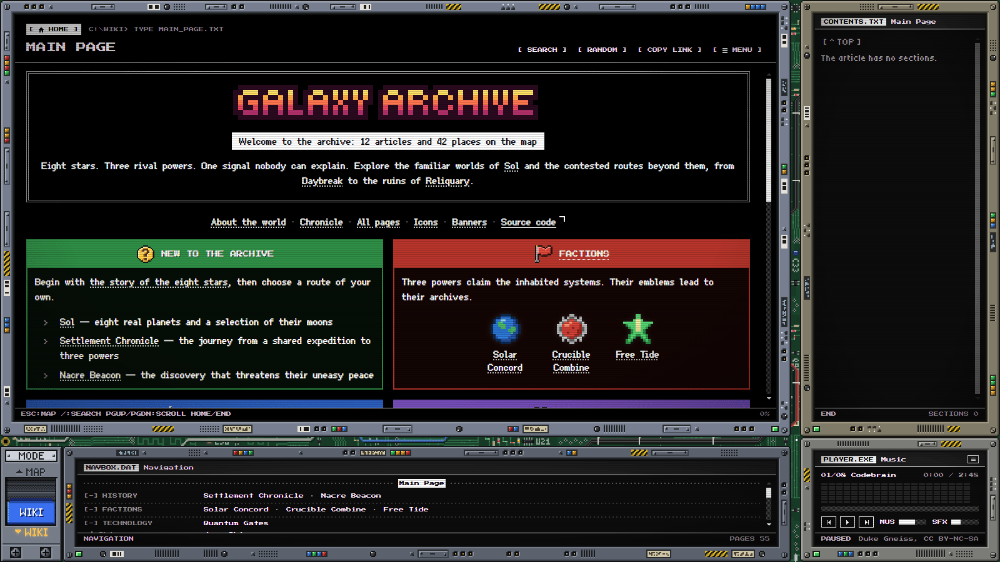

# Stellar Archive

[English](#english) · [Українська](#ukrainian)

## English

**Galaxy map, wiki, and editor.**

Stellar Archive is a galaxy map and a wiki for fictional settings. It includes an editor for adding systems, planets, stations, and articles. The interface is styled after old computer terminals.



### Features

#### Galaxy and routes

The galaxy map can be zoomed and panned. It shows stars, faction territories, animated routes, and unexplored space.



#### Star systems

Planets move along their orbits. The system view, data, and visualization have separate windows. Each window can be expanded and restored.



#### Planets, moons, and rings

The visual window shows rotating planets, their moons, and orbital stations. Articles open in the data window; the visual window can be expanded.




#### Orbital stations

Stations come in four types: ring, shipyard, spindle, and outpost. Their sprites show more detail in the expanded window.


#### Wiki

Places on the map link to their wiki articles, and articles can link back to the map. The wiki supports Wikitext and Markdown, page links, categories, search, and navigation.


#### Jumps between systems

The JUMP menu lists connected systems. Switching systems shows a terminal loading screen and CRT shutters.



#### Music player

The player has a track list and a spectrum display. The interface also uses CRT effects, typed text, and sound effects.



#### Hidden command

The terminal appears when all three system windows are minimized. Running `SYNDICATE.EXE` starts a hidden animation that takes over the screens and ends with a reboot.


### Editor

The browser editor is at `/#/edit`. It has tools for editing the galaxy, systems, planets, moons, stations, and articles. It also has settings for the wiki home page, sounds, and loading screens.

Changes are saved as a draft in the browser. **View on site** previews it, **Download** exports the changed files, and **Publish** saves them to your GitHub repository in a commit. Publishing requires a token with write access to that repository.


The demo includes the real Solar System and fictional systems, factions, and settlements. Sizes, distances, and orbital speeds are schematic.

### Quick start

Use **Node.js 22.12+** and **npm**. After cloning the repository, run these commands in its folder:

```sh
npm ci
npm run dev
```

Open the local address printed by Vite. Add `/#/edit` to open the editor.

Build the site for hosting:

```sh
npm run build
```

Upload the contents of `dist/` to a static host. No server application or database is required. For GitHub Pages, choose **Settings → Pages → Source: GitHub Actions** in your copy of the repository; the included workflow builds and deploys changes pushed to `main`.

For content files, editor settings, and publishing details, see the [world creation guide in English](docs/MAP_GUIDE.md#guide-en).

### Technologies and credits

**Vue 3 · Pinia · PixiJS · GSAP · Vite**

Demo music: **[Duke Gneiss](https://soundcloud.com/dukegneiss)** — CC BY-NC-SA 3.0. Fonts: **[Ark Pixel](public/fonts/ArkPixel-OFL.txt)** by TakWolf, **[Tiny5](public/fonts/Tiny5-OFL.txt)** by the Tiny5 Project Authors, and **[Press Start 2P](public/fonts/PressStart2P-OFL.txt)** by the Press Start 2P Project Authors — SIL Open Font License 1.1. Planet articles and illustrations include source credits in the wiki.

---

<a id="ukrainian"></a>

## Українська

**Карта галактики, вікі та редактор.**

Stellar Archive — це карта галактики та вікі для вигаданих світів. У редакторі можна додавати системи, планети, станції та статті. Інтерфейс оформлено в стилі старих комп'ютерних терміналів.


### Можливості

#### Галактика й маршрути

Карту галактики можна масштабувати й переміщувати. На ній показано зорі, території фракцій, анімовані маршрути й незвіданий простір.


#### Зоряні системи

Планети рухаються орбітами. Огляд системи, дані та візуалізація мають окремі вікна. Кожне можна розгорнути й повернути до початкового розміру.


#### Планети, супутники й кільця

У вікні візуалізації показано планети, що обертаються, їхні супутники та орбітальні станції. Статті відкриваються у вікні даних; вікно візуалізації можна розгорнути.


#### Орбітальні станції

Є чотири типи станцій: кільце, верф, веретено й аванпост. У розгорнутому вікні на їхніх зображеннях видно додаткові деталі.


#### Вікі

Місця на карті мають посилання на свої статті у вікі, а зі статей можна повернутися до карти. Вікі підтримує Wikitext і Markdown, посилання між сторінками, категорії, пошук і навігацію.


#### Переходи між системами

Меню JUMP показує системи, з'єднані маршрутами. Під час переходу між системами з'являються термінальний екран завантаження та CRT-шторки.


#### Музичний програвач

У програвачі є список композицій і відображення звукового спектра. В інтерфейсі також є CRT-ефекти, поступова поява тексту та звукові ефекти.


#### Прихована команда

Термінал з'являється, коли згорнуто всі три вікна системи. Команда `SYNDICATE.EXE` запускає приховану анімацію, яка захоплює екрани й завершується перезавантаженням.


### Редактор

Браузерний редактор доступний за адресою `/#/edit`. У ньому можна редагувати галактику, системи, планети, супутники, станції та статті. Також є налаштування головної сторінки вікі, звуків та екранів завантаження.

Зміни зберігаються як чернетка в браузері. **View on site** відкриває її попередній перегляд, **Download** експортує змінені файли, а **Publish** зберігає їх у вашому GitHub-репозиторії одним комітом. Для публікації потрібен токен із правом запису до цього репозиторію.


Демонстраційний світ містить справжню Сонячну систему та вигадані системи, фракції й поселення. Розміри, відстані та швидкості руху орбітами показано схематично.

### Швидкий старт

Використовуйте **Node.js 22.12+** та **npm**. Після клонування репозиторію виконайте ці команди в його теці:

```sh
npm ci
npm run dev
```

Відкрийте локальну адресу, яку виведе Vite. Додайте `/#/edit`, щоб перейти до редактора.

Зберіть сайт для розміщення на хостингу:

```sh
npm run build
```

Завантажте вміст `dist/` на статичний хостинг. Серверний застосунок і база даних не потрібні. Для GitHub Pages виберіть **Settings → Pages → Source: GitHub Actions** у своїй копії репозиторію; наявний workflow збирає й публікує сайт після надсилання змін до `main`.

Про файли вмісту, налаштування редактора й публікацію читайте в [посібнику зі створення світу українською](docs/MAP_GUIDE.md#guide-uk).

### Технології та автори матеріалів

**Vue 3 · Pinia · PixiJS · GSAP · Vite**

Музика демонстраційного світу: **[Duke Gneiss](https://soundcloud.com/dukegneiss)** — CC BY-NC-SA 3.0. Шрифти: **[Ark Pixel](public/fonts/ArkPixel-OFL.txt)** від TakWolf, **[Tiny5](public/fonts/Tiny5-OFL.txt)** від авторів проєкту Tiny5 та **[Press Start 2P](public/fonts/PressStart2P-OFL.txt)** від авторів проєкту Press Start 2P — SIL Open Font License 1.1. Джерела статей про планети й ілюстрацій зазначено у вікі.
