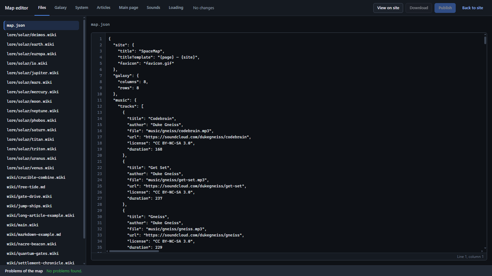

# Stellar Archive — full guide

[English](#guide-en) · [Українська](#guide-uk)

<a id="guide-en"></a>

## English

This guide covers creating a world, editing its files, and publishing a Stellar Archive site. The map and wiki are stored in plain files. The browser editor changes those files through a local draft; it does not need a database or a server application.

The interface uses English by default. Ukrainian documentation does not install a Ukrainian interface; the [localization section](#en-strings-and-language) explains how to translate it.

<a id="en-contents"></a>

### Contents

- [1. Getting started](#en-getting-started)
    - [Repository and local server](#en-repository-and-local-server)
    - [First changes](#en-first-changes)
- [2. Browser editor](#en-browser-editor)
    - [Files](#en-files)
    - [Galaxy](#en-galaxy)
    - [System](#en-system)
    - [Articles](#en-articles)
    - [Main page](#en-main-page)
    - [Sounds](#en-sounds)
    - [Loading](#en-loading)
    - [Automatic values and deletion](#en-automatic-values-and-deletion)
- [3. Drafts, export, and publication](#en-drafts-export-and-publication)
    - [Draft storage and preview](#en-draft-storage-and-preview)
    - [Download](#en-download)
    - [Publish to GitHub](#en-publish-to-github)
- [4. Files and JSON](#en-files-and-json)
    - [Content paths](#en-content-paths)
    - [JSON rules](#en-json-rules)
    - [Complete example](#en-complete-example)
- [5. Map configuration reference](#en-map-configuration-reference)
    - [Site](#en-site)
    - [Galaxy and factions](#en-galaxy-and-factions)
    - [Stars and lore](#en-stars-and-lore)
    - [Systems and planets](#en-systems-and-planets)
    - [Planet appearance](#en-planet-appearance)
    - [Moons and stations](#en-moons-and-stations)
    - [Routes](#en-routes)
    - [World text and legend](#en-world-text-and-legend)
    - [Wiki and lore configuration](#en-wiki-and-lore-configuration)
    - [Music and sound effects](#en-music-and-sound-effects)
    - [Theme](#en-theme)
    - [Strings and language](#en-strings-and-language)
    - [Loading screens](#en-loading-screens)
    - [Terminal](#en-terminal)
- [6. Articles and the main page](#en-articles-and-the-main-page)
    - [Formats and links](#en-formats-and-links)
    - [Images, tables, and notes](#en-images-tables-and-notes)
    - [Templates and page blocks](#en-templates-and-page-blocks)
- [7. Build and hosting](#en-build-and-hosting)
    - [Local build](#en-local-build)
    - [GitHub Pages](#en-github-pages)
    - [Other static hosts](#en-other-static-hosts)
- [8. Troubleshooting](#en-troubleshooting)
- [9. Addresses and link previews](#en-addresses-and-link-previews)
    - [Application addresses](#en-application-addresses)
    - [Social cards and the public URL](#en-social-cards-and-the-public-url)

<a id="en-getting-started"></a>

### 1. Getting started

<a id="en-repository-and-local-server"></a>

#### Repository and local server

Make your own copy of the repository with **Fork**, then clone your copy. Keep the demo until you have checked that the site runs. You can edit it or replace it with the complete example below.

On your copy's GitHub page, open **Code** and copy its HTTPS URL. Run `git clone <copied-url>`, then `cd <repository-folder>` in your terminal, replacing the placeholders with that URL and folder.

Use Node.js **22.12 or newer** and npm. In the repository folder:

```sh
npm ci
npm run dev
```

Open the address printed by Vite. The site starts on the galaxy map. The MAP/WIKI switch changes modes, a star opens its system, and a planet opens its data and visualization. The JUMP menu lists connected systems.

Append `#/edit` to the site's base address to open the editor. For example, `http://localhost:5173/#/edit`. Use the actual port printed by Vite.

Opening `index.html` directly with `file://` does not work: the browser needs an HTTP server to fetch the map and its resources. `npm run dev` supplies that server locally.

<a id="en-first-changes"></a>

#### First changes

1. In **Galaxy**, select an empty sector and use **Add a star here**. Give the star a name and an id.
2. In **System**, select that star and use **Add a planet**. Set its name, orbit, appearance, and lore.
3. In **Articles**, create an article and write its text. Set **Place on the map** if the article describes a map object.
4. In **Main page**, choose the home article and add a banner or a box linking to your article.
5. Use **View on site** to check the result. Return with **Editor**; **Leave the draft** shows the published files again.
6. Fix issues in **Problems of the map**, then download or publish the draft as described below.

<a id="en-browser-editor"></a>

### 2. Browser editor



The seven tabs edit the same draft. Forms update `map.json`; article editors update inline text or the referenced article file. They preserve unrelated JSON text rather than reformatting the whole map. Some settings, such as the theme and music playlist, are edited directly in **Files**.

<a id="en-files"></a>

#### Files

- Select `map.json` or a referenced text file from the list. The list includes articles, lore, terminal files, and configured sound files; it is not a general file browser for every asset in the repository.
- A missing referenced file is marked **no file**. **Create** adds it to the draft. An incorrect path must also be corrected in `map.json`.
- Changed files have a dot. **Undo changes** restores the selected file to the editor's original version.
- Wikitext and Markdown files have a rendered preview beside the text. **Hide preview** and **Show preview** toggle it. Sound files have playback controls instead of a text editor.
- **Problems of the map** checks the draft while you edit. Selecting a problem points to its location in `map.json`. Invalid JSON disables forms that need to read the map.

<a id="en-galaxy"></a>

#### Galaxy

- Select an empty sector to add a star, or select a star to change its id, name, faction, position, and lore or delete it. Each sector holds one star; coordinates start at `0,0` in the upper-left corner.
- Renaming a star id in the form updates its system key and routes. Moving a star updates routes that use its sector coordinates. Hand-editing an id in **Files** does not perform these related changes for you.
- Use **Add a route from here**, then select the destination star. Select a route to edit its type, description, direction, pulse, and appearance, or delete it.
- **Factions** edits names, territory colors and opacity, borders, and galaxy dimensions. Deleting a faction leaves its stars without that faction.
- **Types of routes** edits the built-in route types and adds custom ones. Deleting a custom type removes that type from its routes.

<a id="en-system"></a>

#### System

- Select a star, add planets, and select a planet to edit its orbit, appearance, and lore. **Add a moon** and **Add a station** add entries to the selected planet.
- The ↑ and ↓ buttons change list order. Planet and satellite URLs use this order, so reordering or deleting an entry can change what an existing numbered URL opens.
- A seed gives a repeatable generated surface. A built-in preset such as `earth` supplies its own surface and liquid settings; the form locks those fields. Select **— none —** to configure a generated surface. Size and rings remain configurable for presets.
- A station has a type, hull color, and light color. The preview shows changes to its appearance.
- Lore can be inline or stored in a separate file. Referenced lore files can also be opened in **Files**.

<a id="en-articles"></a>

#### Articles

- Create an article with a title and format. The editor adds its entry and a file under `wiki/`.
- Set its group, aliases, categories, map place, and whether it is the home page. Renaming a title keeps the old title as an alias; existing links can still find it.
- Edit the text beside its preview. Existing page links are blue; missing page links are red. Use **View on site** to check the complete wiki: counters such as `{{NUMBEROFPAGES}}` show `0` in the isolated article preview.
- **Groups of articles** adds and reorders groups, changes their title and icon, and moves groups with their children. Groups support three levels. Deleting a group also deletes its subgroups; their articles remain without a group.
- The world page **Galaxy** is available here too. Its content comes from `worldLore` or `worldLoreFile`.

<a id="en-main-page"></a>

#### Main page

Choose the home article, or create one when the wiki currently opens on Galaxy. The page is edited as an ordered list of blocks with a preview:

| Block | Settings |
|---|---|
| Banner | Title or image logo, colors, style, font, scale, shadow, animation, frame, caption, and text |
| Box | Title, destination page, color, icon, full-width option, and text |
| Links | A row of page or external links |
| Archive sections | Generated navigation for wiki groups and places |
| Text | Ordinary article text |

**Add** appends a block; ↑ and ↓ move it. Blocks are saved as templates in the home article. Text written by hand is kept alongside the blocks.

<a id="en-sounds"></a>

#### Sounds

- Select a sound and preview it with ▶. **UPLOAD** replaces it with a WAV, MP3, or OGG file, up to **300 KiB** (`300 × 1024` bytes).
- The recording becomes a file under `sounds/` in the draft. It is included in downloads and publication; it is not just a temporary preview.
- **SILENCE** disables the selected sound. **USE BUILT-IN** removes its override.
- The music playlist is configured separately in `music`; this tab edits interface sound effects.

<a id="en-loading"></a>

#### Loading

Edit the loader title and lines for startup, entering a system, returning to the galaxy, and entering the wiki. ▶ previews a group with the current map's counts. An empty override uses the built-in text.

This tab also sets whether the site's sound effects are enabled and their initial volume. Loading text describes the transition; it does not change the underlying loading tasks or their duration.

<a id="en-automatic-values-and-deletion"></a>

#### Automatic values and deletion

**Auto**, **As its type**, and a `default:` hint mean that a value is inherited or absent from `map.json`. Entering a value writes an override. Clearing a numeric field or using **Reset** removes its key; it does not necessarily write the currently visible default. Numeric forms accept a decimal comma such as `0,5`; JSON itself requires `0.5`. Invalid input is marked and is not written.

Deleting an article, star, planet, or satellite can also mark its referenced files for deletion if no other map field references them. Deleted files are crossed out in **Files**; **Keep it** cancels the file deletion. This is separate from restoring the deleted map object.

After renaming a map body, check links to its old name and article `place` fields. When changing faction or group ids by hand, also update their references: `faction`, `planetTextColors`, `group`, and `wiki.worldGroup`. Changing a display name is different from changing an id.

<a id="en-drafts-export-and-publication"></a>

### 3. Drafts, export, and publication

<a id="en-draft-storage-and-preview"></a>

#### Draft storage and preview

Drafts are stored in this browser's local storage for the site folder. Reloading or closing the page normally keeps them. Another browser or computer does not receive the draft. Clearing browser data removes it.

If the editor reports that the draft could not be saved, storage may be unavailable or full. Download the changes before closing the page. Uploaded sound files count towards browser storage, including their encoded representation.

**View on site** displays the draft with a **Draft of the editor** banner. **Editor** returns to editing. **Leave the draft** returns to the site's current files without deleting the draft.

Use **Undo changes** in Files to restore one file. **Throw away the draft** asks for confirmation and removes all draft changes, including uploads and pending deletions. Download a copy first if you need to keep them.

<a id="en-download"></a>

#### Download

**Download** exports only changes, not a complete website:

- One changed file with no deletions is downloaded directly, using its filename.
- Multiple files or deletions produce `site-edits.zip`, retaining folder paths.
- `DELETED.txt` lists files to delete manually. Extracting the ZIP does not delete them.

Apply downloaded files under `public/` in the source repository, then build the site. If you maintain a built static site instead, apply them beside its `index.html`. Keep the folder paths; a downloaded article's basename alone does not tell you where it belongs.

<a id="en-publish-to-github"></a>

#### Publish to GitHub

**Publish** sends the changed files and deletions to your repository in one commit. Set:

| Setting | Value |
|---|---|
| Repository (owner/name) | `owner/repository`; guessed from a `github.io` address when possible |
| Branch | An existing branch; default `main` |
| Folder of the site in it | Content directory in the repository; default `public` |
| Token | A personal access token allowed to write to this repository |
| What changed | A description of the changes |

For a repository you own, create a fine-grained token in GitHub **Settings → Developer settings → Personal access tokens → Fine-grained tokens**. Choose the resource owner, limit access to that repository, set an expiration, and grant **Contents: Read and write**. Generate the token and paste it into the editor. See GitHub's [token instructions](https://docs.github.com/en/authentication/keeping-your-account-and-data-secure/managing-your-personal-access-tokens) and [required permissions](https://docs.github.com/en/rest/authentication/permissions-required-for-fine-grained-personal-access-tokens).

The token is sent to `api.github.com`. Without **Remember the token on this computer**, it stays in session storage for the tab. With that option, it is saved in local storage. Sites sharing an origin can access that storage; GitHub Pages projects of the same owner share an origin. Use a token restricted to your repository and leave the option off on shared computers. Do not put tokens in `map.json`, article files, or commits.

Publication compares changed files with the versions on which the draft was based. If a file has changed on GitHub, the editor lists the conflict. **Cancel** keeps the draft; download it and compare the versions. **Write over** publishes your version over the conflicting file. Unrelated repository files are retained. A broken root map blocks publication; review other reported issues too.

If the branch changes during publication, GitHub can reject the final update. The editor reports the error rather than forcing the branch; compare the current files and retry.

The resulting commit and workflow are linked in the publication window. A commit saves content; deployment is a separate step. Wait for the Pages workflow to finish successfully and check its deployment URL. The editor does not upload a new application build itself.

<a id="en-files-and-json"></a>

### 4. Files and JSON

<a id="en-content-paths"></a>

#### Content paths

| Path in the repository | Purpose |
|---|---|
| `public/map.json` | Map, article index, and site configuration |
| `public/wiki/` | Wiki article files |
| `public/lore/` | Separate star, planet, and satellite lore files |
| `public/lore/images/` | Default folder for article images |
| `public/music/` | Locally hosted music tracks |
| `public/sounds/` | Custom interface recordings |
| `public/terminal.txt` | Optional custom terminal script |
| `public/favicon.gif` | Default browser tab icon |

After a build, the contents of `public/` sit beside `dist/index.html`. Paths inside `map.json` are relative to that map file: write `wiki/history.wiki`, not `public/wiki/history.wiki`.

The editor manages local paths inside the site: no URL scheme, leading `/`, or `..` path segment. External resources can be configured in supported fields, but cannot be edited as local files in **Files**. Add ordinary images and music files to `public/` yourself; the sound upload form is not a general asset uploader.

<a id="en-json-rules"></a>

#### JSON rules

The root is one object. Objects use `{}`, lists use `[]`, and field names and strings use double quotes. Commas separate items; there is no trailing comma. Numbers, `true`, `false`, and `null` are unquoted. Comments are not allowed. Inside strings, use `\n` for a newline and `\\` for a backslash.

The only required root field is the `stars` array. An empty array is accepted but produces an empty-map warning. Other sections can be omitted. A fragment below shows fields to merge into the root object; it is not a replacement for the entire map.

Do not duplicate keys: many JSON readers silently keep only the last value. Escape a quote inside a string as `\"`; use a decimal point in numbers.

<a id="en-complete-example"></a>

#### Complete example

This is a complete `map.json`. It has two stars, one planet with a moon and a station, a route, and a home article. All article text is inline, so no extra article files are needed. Try it in a separate copy of the project.

```json
{
  "site": { "title": "Stellar Archive", "language": "en" },
  "galaxy": { "columns": 4, "rows": 3 },
  "factions": {
    "harbor": { "name": "Harbor Union", "fillColor": "#336699", "borderColor": "#66aaff" }
  },
  "stars": [
    { "id": "helion", "name": "Helion", "sectorX": 1, "sectorY": 1, "faction": "harbor", "lore": "A system with the planet [[Haven]]." },
    { "id": "vesper", "name": "Vesper", "sectorX": 3, "sectorY": 1, "lore": "A neighboring system connected to [[Helion]]." }
  ],
  "systems": {
    "helion": {
      "planets": [
        {
          "name": "Haven", "orbitRadius": 80, "angle": 180, "speed": 0.001,
          "lore": "'''Haven''' is a settlement of the [[Harbor Union]].",
          "visualization": { "seed": "haven", "size": 80, "landColor": "#669966", "waterColor": "#336699", "waterAmount": 0.5 },
          "satellites": [
            { "name": "Haven Moon", "kind": "moon", "lore": "The moon of [[Haven]].", "visualization": { "seed": "moon" } },
            { "name": "Ring Port", "kind": "station", "type": "ring", "color": "#b8c4d0", "lights": "#ffe2a8", "lore": "A station above [[Haven]]." }
          ]
        }
      ]
    },
    "vesper": { "planets": [] }
  },
  "hyperlines": [
    { "id": "helion-vesper", "type": "gate", "from": "helion", "to": "vesper", "description": "Helion–Vesper gate" }
  ],
  "worldLore": "The [[Harbor Union]] maintains a route between [[Helion]] and [[Vesper]].",
  "wiki": {
    "home": "Main Page",
    "groups": [{ "id": "history", "title": "History", "icon": "book" }],
    "articles": [
      { "title": "Main Page", "text": "{{Banner|title=Stellar Archive|style=steel|caption=A small example}}\n\n{{Box|Haven|color=blue|link=Haven|text=Read about [[Haven]].}}" },
      { "title": "Harbor Union", "group": "history", "text": "'''Harbor Union''' maintains [[Ring Port]]." }
    ]
  }
}
```

<a id="en-map-configuration-reference"></a>

### 5. Map configuration reference

Unless noted otherwise, fields are optional. Use six-digit colors such as `#00aaff` or `0x00aaff`. Numeric color values are accepted by map renderers, but quoted hex strings are clearer in JSON. Sizes and orbital speeds describe a schematic display, not physical measurements.

<a id="en-site"></a>

#### Site

| Field | Meaning and default |
|---|---|
| `site.title` | Site name in the tab and `{{SITENAME}}`; code fallback is still `SpaceMap` |
| `site.titleTemplate` | Must include `{page}`; also accepts `{site}`, `{star}`, `{planet}`; default `{page} — {site}` |
| `site.favicon` | Image path or HTTP(S) URL; default `favicon.gif`; GIFs can animate |
| `site.language` | Locale for number forms, sorting, and text layout; default `en`; does not translate content by itself |
| `site.url` | Absolute public base URL, including any subfolder; used for preview images |
| `site.description` | Preview description, truncated to 300 characters; otherwise derived from the home article |
| `site.preview` | Custom social preview image; 1200×630 is recommended; otherwise a card is generated |

JSON fragment:

```json
{ "site": { "title": "Stellar Archive", "titleTemplate": "{page} — {site}", "favicon": "favicon.gif", "language": "en" } }
```

<a id="en-galaxy-and-factions"></a>

#### Galaxy and factions

| Field | Meaning and default |
|---|---|
| `galaxy.columns`, `galaxy.rows` | Sector grid dimensions, 1–100; default 16×9; the grid expands to include stars outside the requested dimensions |
| `factions.<id>.name` | Display name; defaults to the faction id |
| `fillColor`, `borderColor` | Territory and border colors; one can supply the other's missing value; otherwise grey |
| `fillOpacity` | Territory opacity, 0–1; default 0.15 |
| `borderWidth` | Border thickness; default 2 |
| `planetTextColors.<faction-id>` | Override for star and planet label color by faction |

JSON fragment:

```json
{
  "galaxy": { "columns": 8, "rows": 6 },
  "factions": { "harbor": { "name": "Harbor Union", "fillColor": "#336699", "fillOpacity": 0.15, "borderColor": "#66aaff", "borderWidth": 2 } },
  "planetTextColors": { "harbor": "#99ccff" }
}
```

The editor creates a new faction with explicit `fillOpacity: 0.12`, while an omitted value uses 0.15. Clearing the override restores the renderer's default.

Keep star coordinates inside the grid: `sectorX` from 0 to columns − 1, `sectorY` from 0 to rows − 1. Automatic expansion is capped at 100 sectors on each axis, so it cannot accommodate coordinates of 100 or more.

<a id="en-stars-and-lore"></a>

#### Stars and lore

| Field in `stars[]` | Meaning and default |
|---|---|
| `id` | Required nonempty unique string; used by systems, routes, and URLs |
| `sectorX`, `sectorY` | Required nonnegative integers; one star per sector |
| `name` | Display name; missing or invalid names fall back to the id with a warning |
| `faction` | Existing faction id; unknown factions are removed with a warning |
| `lore`, `loreFile`, `loreFormat` | Inline text, text file, and optional format (`wikitext` or `markdown`) |
| `tabTitle` | Custom page name for the browser tab |
| `starVisualization` | Appearance object; settings below |

Stars with lore have wiki pages. Use stable ids without spaces for convenient URLs. Renaming an id by hand requires updating the matching `systems` key and any routes that refer to it.

Inside `starVisualization`, `size` defaults to 60 and is clamped to 32–100. `color1`, `color2`, and `color3` default to `#ffaa00`, `#ff6600`, and `#ffdd00`. A numeric `seed` is clamped to 1–10; otherwise it is generated from the star id or name. `rotation` is the surface-flow angle in degrees; `spinSpeed` controls flow, with 0 stopping it and negative values reversing it. Both are generated from the seed when omitted; the automatic spin speed is between 0.6 and 1.5.

<a id="en-systems-and-planets"></a>

#### Systems and planets

`systems.<star-id>` belongs to the star with that id. A system for an unknown star is retained but cannot be opened from the map. Its `legend` or `legendFile` supplies a system-specific legend note, with optional `legendFormat`; `planets` is an ordered array.

| Planet field | Meaning and default |
|---|---|
| `name` | Required nonempty string |
| `orbitRadius` | Positive number; invalid or missing values use the greatest preceding radius + 30 and produce a warning |
| `angle` | Initial angle in degrees; default 0 |
| `speed` | Radians per reference frame at 60 fps; default 0.001; 0 stops orbital movement, negative values reverse it |
| `lore`, `loreFile`, `loreFormat`, `tabTitle` | Article text, format, and tab title, as for stars |
| `visualization` | Surface settings below; missing seeds use `id` or `name` |
| `satellites` | Ordered array of moons and stations |

An editor-created first planet starts at radius 40, and subsequent planets are added 30 beyond the furthest orbit. This differs from the validator's fallback for a missing radius.

<a id="en-planet-appearance"></a>

#### Planet appearance

| Field inside `visualization` | Meaning and default |
|---|---|
| `seed` | String or number for repeatable generation; defaults to the body's `id` or `name` |
| `size` | Display size; default 100; use a positive number |
| `landColor` | Land color; generated surface default `#44aa44` |
| `waterColor` | Liquid color; without an override, follows the liquid type |
| `waterAmount` | Liquid coverage, clamped to 0–1; default 0.6 |
| `waterType` | `water`, `lava`, `acid`, `magma`, `ice`, `methane`, `ammonia`, `oil`; default `water` |
| `ring` | Ring object, or `null` for no ring; default none for generated surfaces |
| `ring.size` | `thin`, `medium`, `large`; unrecognized sizes render as `medium` |
| `ring.color` | Ring color; default grey (`#aaaaaa`) |

Built-in surface seeds are `mercury`, `venus`, `earth`, `moon`, `mars`, `phobos`, `deimos`, `jupiter`, `saturn`, `uranus`, `neptune`, and `pluto`. They set surface colors and liquid values. Explicit size and ring settings still apply; use `ring: null` to remove a preset's ring. Other names, including `titan`, produce generated surfaces rather than built-in presets.

JSON fragment, showing a planet to insert into a system's `planets` array:

```json
{ "name": "Haven", "orbitRadius": 80, "visualization": { "seed": "haven", "size": 80, "landColor": "#669966", "waterType": "water", "waterAmount": 0.5, "ring": { "size": "thin", "color": "#bbaa88" } } }
```

<a id="en-moons-and-stations"></a>

#### Moons and stations

Satellites are entries in a planet's `satellites` array. Their own `visualization` applies to moons; stations use their type and colors.

| Satellite field | Meaning and default |
|---|---|
| `name` | Display name; missing names become the planet name plus the satellite's list number, with a warning |
| `kind` | `moon` or `station`; default `moon`; unknown kinds are skipped |
| `distance` | Positive orbit radius in planet radii; default 2.2, then +0.7 for subsequent valid satellites |
| `size` | Positive radius relative to the planet, capped at 1; default 0.3 for a moon, 0.35 for a station |
| `angle` | Initial angle in degrees; otherwise distributed automatically |
| `speed` | Same units as planets; default 0.012 for moons, 0.02 for stations; 0 stops movement, negative values reverse it |
| `lore`, `loreFile`, `loreFormat`, `tabTitle` | Text, format, and tab title |
| `type` | Station only: `ring`, `spindle`, `shipyard`, `outpost`; default `ring` |
| `color`, `lights` | Station hull and light colors; default grey hull and warm lights |

Distances rounded to two decimal places define shared orbits. Bodies sharing an orbit use the speed of its first member; conflicting explicit speeds produce a warning. Crowded visualizations may combine or omit distant miniature orbits to fit the window. Expanded station windows show more sprite detail.

<a id="en-routes"></a>

#### Routes

`hyperlines` is an array of routes. `from` and `to` must identify existing stars, either by id or by `{ "sectorX": 1, "sectorY": 1 }`.

| Field | Meaning and default |
|---|---|
| `id` | Stable unique route id; omitted ids become `line-1`, etc.; duplicates receive a suffix and warning |
| `type` | `gate`, `trade`, `military`, `supply`, `industrial`, or a custom type defined in `hyperlineTypes` |
| `description` | Caption in the JUMP menu |
| `color` | Route color; fallback white |
| `width` | Positive thickness up to 12; fallback 2 |
| `opacity` | 0–1; fallback 0.7 |
| `direction` | `both` or `forward`; default `both`; controls pulses, not one-way travel |
| `pulse` | `{ "speed", "interval", "length" }` or `false` to disable pulses; numbers must be positive |

Appearance is resolved from the route, its custom type configuration, its built-in type, then fallback values. Pulse speed is in map pixels per second, interval in seconds, and length in map pixels.

`hyperlineTypes.<type>` can be a display-name string or an object with `name` and route appearance fields. Pulse objects merge individual fields through these layers. `pulse: false` disables them, but a higher-priority pulse object enables them again; clearing an override restores inheritance.

Built-in defaults:

| Type | Speed | Interval | Length |
|---|---|---|---|
| gate | 170 | 2.6 | 18 |
| trade | 45 | 1.7 | 10 |
| military | 120 | 1.5 | 14 |
| supply | 65 | 1.6 | 10 |
| industrial | 40 | 2 | 10 |
| Unspecified/custom fallback | 70 | 1.6 | 12 |

JSON fragment using the stars from the complete example:

```json
{
  "hyperlineTypes": { "trade": { "name": "Trade routes", "color": "#ffaa00", "width": 2 }, "survey": "Survey routes" },
  "hyperlines": [{ "id": "helion-vesper", "type": "trade", "from": "helion", "to": "vesper", "direction": "forward", "pulse": { "speed": 45, "interval": 1.7, "length": 10 } }]
}
```

<a id="en-world-text-and-legend"></a>

#### World text and legend

`worldLore` or `worldLoreFile` describes the whole setting and supplies the wiki's **Galaxy** page. `worldLoreFormat` overrides its format. `legend` or `legendFile` supplies a note in the galaxy legend, with optional `legendFormat`. Both formats accept `wikitext` or `markdown`; otherwise file extensions and `loreConfig.format` determine the format.

<a id="en-wiki-and-lore-configuration"></a>

#### Wiki and lore configuration

| Field | Meaning and default |
|---|---|
| `wiki.home` | Title of the home article; defaults to Galaxy |
| `wiki.portal` | Set `false` to disable the automatic portal on the home page |
| `wiki.worldGroup` | Group id for Galaxy; otherwise Other pages |
| `wiki.groups` | `{ id, title, icon, groups }` entries; up to three levels; deeper groups merge into level three |
| `wiki.articles[].title` | Required article title; used for links and the URL slug |
| `.file` or `.text` | Separate file or inline text |
| `.format` | `wikitext` or `markdown`; inferred from the file extension when omitted |
| `.group` | Existing group id |
| `.aliases` | Other titles that resolve to the same page |
| `.categories` | Category names in addition to those in the article |
| `.place` | A map body's name or a star id; enables SHOW ON MAP |
| `.tabTitle` | Custom browser tab page name |
| `loreConfig.format` | Default format for text without its own setting; `wikitext` |
| `loreConfig.images` | Folder for Wikitext image names; `lore/images/` |
| `loreConfig.wikiUrl` | Optional external MediaWiki base URL for image lookup and links not found locally |

Stars, planets, moons, and stations with lore get their own wiki pages and generated information cards. Use distinct names and article titles so links are unambiguous. Groups organize navigation; categories organize cross-links. They are separate settings.

If both a file and inline text are set, a successfully loaded file takes precedence. Inline text is used as a fallback if the file cannot be loaded; the missing-file warning still needs attention. This applies to article text, map lore, and legend notes.

JSON fragment (also create the referenced files):

```json
{
  "wiki": {
    "home": "Main Page",
    "groups": [{ "id": "history", "title": "History", "icon": "book" }],
    "articles": [
      { "title": "Main Page", "file": "wiki/main.wiki" },
      { "title": "Harbor Union", "group": "history", "file": "wiki/harbor.md", "aliases": ["HU"], "categories": ["Factions"] }
    ]
  },
  "loreConfig": { "format": "wikitext", "images": "lore/images/" }
}
```

<a id="en-music-and-sound-effects"></a>

#### Music and sound effects

`music.tracks` is an ordered playlist. Each entry needs `file`, a relative path or HTTP(S) URL. Optional fields are `title` (otherwise the filename), `author`, `url` (the source page), `license`, and `duration` (positive seconds). Put your audio files under `public/music/` and credit their authors and licenses.

JSON fragment (provide the recording):

```json
{ "music": { "tracks": [{ "title": "Archive theme", "author": "Your name", "file": "music/archive.ogg", "duration": 180 }] } }
```

Music starts after a visitor presses play. The player shows the playlist, time, and a spectrum. A track without a known duration shows an unknown length until metadata loads. Browsers may block audio before a user interacts with the page.

| Sound setting | Meaning |
|---|---|
| `sounds: false` | Disable all interface sound effects; separate from music |
| `sounds.volume` | Initial volume, 0–1; default 0.35; visitors can keep their own setting |
| `sounds.<name>: false` | Silence this sound |
| `sounds.<name>: "sounds/click.wav"` | Replace it with a recording |
| `sounds.<name>: { "file": "…", "volume": 0.5 }` | Recording and/or individual volume override |

The supported names and built-in previews are on **Special:Sounds**. Unknown names are ignored with a warning. A recording that cannot be loaded falls back to the built-in sound; it is not equivalent to explicit silence.

JSON fragment:

```json
{ "sounds": { "volume": 0.35, "click": "sounds/click.wav", "hover": false, "menuOpen": { "volume": 0.5 } } }
```

<a id="en-theme"></a>

#### Theme

| Field | Values and default |
|---|---|
| `theme.preset` | `white` (default), `amber`, `green` |
| `theme.colors` | Overrides for the color roles below |
| `theme.casings` | One name or an array: `blue`, `grey`, `warm`, `gunmetal`; all four used by default |
| `theme.crt` | `scanlines`, `vignette`, `sweep`, `glow`: strengths 0–2; 1 is the default, 0 disables an effect |

| Color role | Use | Default in `white` |
|---|---|---|
| `text` | Main text | `#ffffff` |
| `dim` | Secondary text | `#9a9a9a` |
| `line` | Lines and borders | `#555555` |
| `screen` | Screen background | `#000000` |
| `accent` | Links and highlights | `#cfe0ff` |
| `ok` | Enabled states and OK labels | `#66ff66` |
| `warn` | Warnings | `#ffc24a` |
| `error` | Errors | `#ff5555` |

Theme colors accept `#rgb`, `#rrggbb`, or `0xrrggbb`. Invalid settings fall back with a map-check message; CRT strengths above 2 are capped. Casings are chosen from the allowed list for individual frames. These settings do not replace planet or faction colors. Remove an override to return to the preset; remove `theme` to return to the default appearance.

JSON fragment:

```json
{ "theme": { "preset": "amber", "colors": { "accent": "#ffffff" }, "casings": ["warm"], "crt": { "scanlines": 1, "vignette": 0.5, "sweep": 0, "glow": 1 } } }
```

<a id="en-strings-and-language"></a>

#### Strings and language

`site.language` selects the locale, while `strings` supplies translations. An untranslated key uses its English text. This guide's Ukrainian translation does **not** mean that a complete Ukrainian interface is bundled.

Use the keys in [strings.en.json](strings.en.json) as a reference. `strings` accepts nested objects or dotted keys. A value is a string or a plural object with `zero`, `one`, `two`, `few`, `many`, and/or `other`. The locale's `Intl.PluralRules` chooses the form; include `other` as a fallback.

Keep placeholders such as `{count}`, `{star}`, `{page}`, and `{message}` in translated messages. Unknown keys and missing placeholders produce warnings. Loader lines are an exception: their dynamic values may be omitted deliberately. Service-page addresses and diagnostic messages remain English. Long or unsupported labels on the pixel-drawn MAP/WIKI switch can retain the English label.

JSON fragment with partial Ukrainian localization:

```json
{
  "site": { "title": "Stellar Archive", "language": "uk" },
  "strings": {
    "panels": { "system": "Система", "noArticle": "Немає статті" },
    "loader": {
      "openingSystem": "ВІДКРИТТЯ СИСТЕМИ {star}",
      "openingArticle": "ВІДКРИТТЯ СТАТТІ {page}",
      "mapProblems": {
        "one": "ПЕРЕВІРКА КАРТИ: {count} ПРОБЛЕМА",
        "few": "ПЕРЕВІРКА КАРТИ: {count} ПРОБЛЕМИ",
        "many": "ПЕРЕВІРКА КАРТИ: {count} ПРОБЛЕМ",
        "other": "ПЕРЕВІРКА КАРТИ: {count} ПРОБЛЕМИ"
      }
    }
  }
}
```

For Ukrainian, 1 and 21 use `one`, 2–4 use `few`, and 5–20 use `many`; fractions use `other`. Article names and text, faction names, and music metadata must be translated separately.

<a id="en-loading-screens"></a>

#### Loading screens

Loading messages are entries under `strings.loader`, not a separate top-level `loading` object. The title is `strings.loader.title`. The groups run in this order:

| Transition | Line keys under `strings.loader` |
|---|---|
| Startup | `loadingCatalog`, `checkingMap`, `loadingArchives`, `buildingTerritories`, `initRenderer`, `drawingMap`, `routingHyperlines`, `ignitingStars` |
| System | `openingSystem`, `calculatingOrbits`, `renderingPlanets` |
| Galaxy | `openingGalaxy`, `resumingMap` |
| Wiki | `openingArticle`, `openingWiki`, `mountingWiki` |

`checkingMap`, `loadingArchives`, `routingHyperlines`, `calculatingOrbits`, and `renderingPlanets` receive `{count}`; `openingSystem` receives `{star}`; `openingArticle` receives `{page}`. Other lines have no dynamic value. Short labels fit narrow screens better; the editor warns about long lines. Clearing a line in **Loading** restores the built-in text.

JSON fragment:

```json
{ "strings": { "loader": { "title": "STELLAR ARCHIVE", "openingSystem": "READING {star}", "calculatingOrbits": "ORBITS: {count}" } } }
```

<a id="en-terminal"></a>

#### Terminal

Minimize the map windows to use the terminal. It has a DOS-like prompt and commands such as `HELP`, `DIR`, `CD`, `TYPE`, `CLS`, and `VER`. Its built-in script and files work without configuration.

| Field | Meaning and default |
|---|---|
| `terminal.script` | Relative path to a text script; otherwise the built-in script |
| `terminal.files` | Object mapping DOS filenames to text-file paths |
| `terminal.syndicate` | Enable the `SYNDICATE.EXE` hidden command; default `true` |

DOS filenames must be a single name without spaces or `\\ / : * ? " < > \|`. `TYPE` displays the configured text. Setting `syndicate` to `false` disables the hidden program and its built-in hint; a custom text file can still contain any text you wrote.

JSON fragment (create these files):

```json
{ "terminal": { "script": "terminal.txt", "files": { "README.TXT": "terminal/readme.txt" }, "syndicate": false } }
```

A script is a plain `.txt` file. A prompt line defines a command and the following lines define its output. `~` introduces a spinner line. This is a small scripted terminal, not an operating-system shell:

```text
C:\>VER
Stellar Archive terminal
C:\>DIR
README   TXT
C:\>SCAN
~Reading archive
Scan complete.
```

<a id="en-articles-and-the-main-page"></a>

### 6. Articles and the main page

<a id="en-formats-and-links"></a>

#### Formats and links

Set `format: "wikitext"` or `"markdown"` on an article, or `loreFormat` on a map body. A `.md` or `.markdown` filename selects Markdown automatically; other text follows `loreConfig.format`. Plain text also works. This is a built-in subset of both formats, not full MediaWiki or CommonMark compatibility.

| Feature | Wikitext | Markdown |
|---|---|---|
| Heading | `== History ==` | `## History` |
| Bold / italic | `'''bold'''` / `''italic''` | `**bold**` / `*italic*` |
| Lists | `* item`, `# item` | `- item`, `1. item` |
| Local page link | `[[Haven]]`, `[[Haven\|the planet]]` | `[the planet](Haven)` |
| Section link | `[[Haven#History]]` | `[history](Haven#History)` |
| External link | `[https://example.org source]` | `[source](https://example.org)` |
| Image | `[[File:haven.png\|thumb\|right\|Haven]]` | `` |
| Category | `[[Category:Planets]]` | `[[Category:Planets]]` |
| Footnote | `<ref>Source.</ref>`, `<references />` | `[^1]` and `[^1]: Source.` |

Links to local pages are resolved against articles, aliases, and map places. Missing pages appear in **Special:Wanted pages**; an external `wikiUrl` can supply their destination. Categories also come from `wiki.articles[].categories`. In Wikitext a leading colon, as in `[[:Category:Planets]]`, links to a category instead of adding the article to it. In Markdown use `[Planets](Category%3APlanets)`, encoding the colon.

<a id="en-images-tables-and-notes"></a>

#### Images, tables, and notes

Wikitext image names use `loreConfig.images`; Markdown image paths are relative to `map.json`. Include the actual files under `public/`. The renderer supports captions, galleries, table cells, lists, quotations, code, and footnotes. It accepts a limited set of HTML tags and styles and removes unsafe URLs; JavaScript, arbitrary page CSS, and embedded applications are not supported.

Wikitext example (provide `lore/images/haven.png` to show the image):

```wikitext
{{Main|Harbor Union}}
== Haven ==
'''Haven''' orbits [[Helion]]. See [[Ring Port|the station]].
[[File:haven.png|thumb|right|Haven]]
* One moon
* One station
{| class="wikitable"
! Object !! Type
|-
| [[Haven Moon]] || Moon
|-
| [[Ring Port]] || Station
|}
The port opened in year 12.<ref name="date">Archive record 12.</ref>
<references />
[[Category:Planets]]
```

Markdown example using the same local pages:

```markdown
## Haven
**Haven** orbits [Helion](Helion). See [the station](Ring_Port).


| Object | Type |
|---|---|
| [Haven Moon](Haven_Moon) | Moon |
| [Ring Port](Ring_Port) | Station |

The port opened in year 12.[^date]

[^date]: Archive record 12.

[[Category:Planets]]
```

<a id="en-templates-and-page-blocks"></a>

#### Templates and page blocks

Supported built-ins include `{{Main|Page}}`, `{{See also|Page}}`, `{{Further|Page}}`, `{{Stub}}`, `{{Warning|Text}}`, `{{Notice|Text}}`, and `{{Reflist}}`. Counters are `{{NUMBEROFPAGES}}`, `{{NUMBEROFARTICLES}}`, `{{NUMBEROFPLACES}}`, `{{NUMBEROFSYSTEMS}}`; `{{SITENAME}}` inserts the site name.

An unknown standalone template with named fields can be displayed as an information card. It does not fetch a MediaWiki template or execute template logic, parser functions, or Lua. In Markdown, put block templates on their own lines.

The **Main page** editor writes these layout templates:

| Template | Parameters |
|---|---|
| `Banner` | `title` or `logo`/`image`; `style`, `colors`, `outline`, `font`, `scale`, `shadow`, `animation`, `frame`, `caption`, `text` |
| `Box` | `title`, `text`, `link`, `color`, `icon`, `wide` |
| `Links` | Positional page or external links |
| `Archive sections` | Generated group and place navigation |
| `Center` | Centered `text` |

Banner styles: `steel`, `sunset`, `phosphor`, `amber`, `ice`, `plasma`, `gold`. Fonts: `tiny5` (default) or `press`. Scale: 1–12, default 8. Animations: `none` (default), `bounce`, `wave`, `float`, `shine`, `flicker`. Frames: `double` (default), `single`, `none`. Shadow is on by default; `shadow=no` turns it off. `colors` is a comma-separated list of hex colors. An image logo replaces the generated text logo.

Box colors: `green`, `blue`, `red`, `purple`, `yellow`, `cyan`, `orange`, `grey`/`gray`, or a hex color; default grey. `wide=yes` spans the page width. See **Special:Icons** and **Special:Banners** for supported icons and logo examples. A home page with a Banner, Box, or Archive sections block supplies its own layout; otherwise the wiki can add an automatic portal unless `wiki.portal` is `false`.

Wikitext main-page example:

```wikitext
{{Banner|title=Stellar Archive|style=steel|font=tiny5|scale=8|animation=shine|frame=double|caption=Systems and records}}

{{Links|[[Galaxy|World overview]]|[[Harbor Union]]|[https://example.org Source]}}

{{Box|title=Haven|color=blue|icon=planet|link=Haven|text=A planet in [[Helion]].}}

{{Archive sections}}
```

<a id="en-build-and-hosting"></a>

### 7. Build and hosting

<a id="en-local-build"></a>

#### Local build

Run in the repository folder:

```sh
npm run build
npm run preview
```

`dist/` contains the deployable site: `index.html`, application assets, content copied from `public/`, and generated social-preview pages and images. Open the preview server address printed in the terminal. Rebuild after changing files; preview serves the last build.

<a id="en-github-pages"></a>

#### GitHub Pages

The repository includes `.github/workflows/pages.yml`. Push your copy to GitHub, then open **Settings → Pages** and choose **GitHub Actions** as the publishing source. A push to `main` or a manual workflow run builds and deploys `dist/`. Inspect the workflow result and the published address; deployment duration is not fixed. See GitHub's [Pages configuration instructions](https://docs.github.com/en/pages/getting-started-with-github-pages/configuring-a-publishing-source-for-your-github-pages-site).

The workflow installs Node.js 22, runs `npm ci`, and builds before deployment. It does not run tests: they check the demo map, so any content edit, including one published from the editor, would fail them. `.github/workflows/tests.yml` runs lint and unit tests separately, only for changes outside `public/`; it never blocks deployment. If you change the working branch, update the workflow trigger and the editor's publication branch accordingly. Its Pages configuration provides `SITE_URL` for the build.

<a id="en-other-static-hosts"></a>

#### Other static hosts

Upload the contents of `dist/` to a static host that serves its folders and files unchanged. The application uses relative asset paths and hash navigation, so it can live in a subfolder and ordinary map/wiki navigation does not need server-side route rewriting. The generated `wiki/` and `system/` preview pages must also be served. The site needs JavaScript in the visitor's browser; there is no server application or database to install.

<a id="en-troubleshooting"></a>

### 8. Troubleshooting

| Symptom | Check |
|---|---|
| Map does not open | Ensure `map.json` is beside `index.html` on the host; use an HTTP server, not `file://` |
| JSON syntax error | Read the reported line and column; check quotes, commas, and number formats; remove comments |
| Map opens with warnings | Open **Special:Map check** or **Problems of the map**; a fallback can hide a configuration mistake |
| Article, image, or sound missing | Check exact filename case, path relative to `map.json`, and the browser Network response |
| JSON error containing HTML | A host returned an error page or SPA fallback instead of `map.json`; inspect the HTTP response |
| Draft does not survive reload | Check the editor's storage warning, browser privacy settings, and available local-storage space; download a backup |
| Old page or assets after deployment | Check the build and deployment results, published path, and browser cache |
| GitHub refuses publication | Check token expiration, selected repository, Contents permission, existing branch, folder, and branch protection; use the reported API error |
| Music silent or spectrum still | Press play after interacting with the page; check volume, format, resource response, and CORS |
| External resource works in its own tab but not here | Its server must allow cross-origin requests; HTTPS sites should use HTTPS resources |

**Special:Map check** reports configuration, fallback, and resource problems collected while loading the site. **Special:Wanted pages** finds unresolved local links; **Special:What links here** finds incoming links for a page. Missing files are not created automatically by deployment.

Cross-origin lore, custom sounds, external wiki image lookup, and image processing need permission from the resource server. External music also needs CORS for Web Audio and its spectrum. A token or a proxy path in `map.json` does not fix a server's CORS policy. Hosting these files with the site avoids that dependency.

<a id="en-addresses-and-link-previews"></a>

### 9. Addresses and link previews

<a id="en-application-addresses"></a>

#### Application addresses

Append these paths to the site's base URL. Examples use the complete map above:

| Address | Opens |
|---|---|
| `#/` | Galaxy map |
| `#/system/helion` | Helion system |
| `#/system/helion/1` | First planet: Haven |
| `#/system/helion/1/1` | First satellite: Haven Moon |
| `#/system/helion/1/2` | Second satellite: Ring Port |
| `#/wiki` | Wiki home |
| `#/wiki/Harbor_Union` | Article |
| `#/wiki/Haven#History` | Article section, if it exists |
| `#/wiki/Category:Planets` | Category page |
| `#/edit` | Editor |

Planet and satellite numbers start at 1 and follow list order. Spaces in wiki titles become underscores; other special characters are URL-encoded. Do not rename star ids casually after sharing links. Reordering a list changes numbered destinations.

Service pages use English names in every locale: `Special:Search`, `Special:All pages`, `Special:Categories`, `Special:Wanted pages`, `Special:What links here`, `Special:Icons`, `Special:Banners`, `Special:Sounds`, and `Special:Map check`. For example, `#/wiki/Special:Map_check` opens the diagnostics.

<a id="en-social-cards-and-the-public-url"></a>

#### Social cards and the public URL

The address bar uses `#/…` for in-app navigation. Social crawlers usually do not run this application or read hash routes. In a built site, **COPY LINK** therefore gives a generated HTML page such as `wiki/Harbor_Union/` or `system/helion/`. It contains metadata and redirects visitors to the application. A system's button shares the system; a wiki page's button shares that page, including pages for planets and satellites. During local development, draft preview, and on service pages, it uses a hash address instead.

Set `site.url` to the final public base URL, with the repository/subfolder and trailing slash. Alternatively, set `SITE_URL` for the build; it takes precedence. An absolute public URL is needed for image metadata. Without one, generated pages can still contain text metadata, but preview images cannot be referenced correctly. Preview cards are created during the build, so rebuild after changing content or the public address.

JSON fragment:

```json
{ "site": { "title": "Stellar Archive", "url": "https://example.org/archive/", "description": "Systems and records of a fictional setting", "preview": "images/archive-card.png" } }
```

The custom `preview` is optional; remove it to use generated artwork. Make the file publicly accessible. The build also creates `robots.txt`, and `sitemap.xml` when the public URL is known. Preview services may cache previous metadata, so a successful deployment does not guarantee an immediate card update everywhere.

Bash:

```bash
SITE_URL=https://example.org/archive/ npm run build
```

PowerShell:

```powershell
$env:SITE_URL = 'https://example.org/archive/'
npm run build
```

In PowerShell the environment variable remains set for that shell session. On GitHub Pages, the included workflow obtains the address from Pages configuration automatically.

---

<a id="guide-uk"></a>

## Українська

Цей посібник пояснює, як створити світ, змінити його файли й опублікувати сайт Stellar Archive. Карта та вікі зберігаються у звичайних файлах. Браузерний редактор змінює їх через локальну чернетку; база даних і серверний застосунок не потрібні.

Типова мова інтерфейсу — англійська. Український посібник не встановлює український інтерфейс; як його перекласти, описано в [розділі про локалізацію](#uk-strings-and-language).

<a id="uk-contents"></a>

### Зміст

- [1. Початок роботи](#uk-getting-started)
    - [Репозиторій і локальний сервер](#uk-repository-and-local-server)
    - [Перші зміни](#uk-first-changes)
- [2. Браузерний редактор](#uk-browser-editor)
    - [Files](#uk-files)
    - [Galaxy](#uk-galaxy)
    - [System](#uk-system)
    - [Articles](#uk-articles)
    - [Main page](#uk-main-page)
    - [Sounds](#uk-sounds)
    - [Loading](#uk-loading)
    - [Автоматичні значення та видалення](#uk-automatic-values-and-deletion)
- [3. Чернетки, завантаження та публікація](#uk-drafts-export-and-publication)
    - [Зберігання чернетки й попередній перегляд](#uk-draft-storage-and-preview)
    - [Завантаження](#uk-download)
    - [Публікація в GitHub](#uk-publish-to-github)
- [4. Файли та JSON](#uk-files-and-json)
    - [Шляхи до вмісту](#uk-content-paths)
    - [Правила JSON](#uk-json-rules)
    - [Повний приклад](#uk-complete-example)
- [5. Довідник налаштувань карти](#uk-map-configuration-reference)
    - [Сайт](#uk-site)
    - [Галактика та фракції](#uk-galaxy-and-factions)
    - [Зорі та описи](#uk-stars-and-lore)
    - [Системи та планети](#uk-systems-and-planets)
    - [Вигляд планети](#uk-planet-appearance)
    - [Місяці та станції](#uk-moons-and-stations)
    - [Маршрути](#uk-routes)
    - [Опис світу та легенда](#uk-world-text-and-legend)
    - [Налаштування вікі та описів](#uk-wiki-and-lore-configuration)
    - [Музика та звукові ефекти](#uk-music-and-sound-effects)
    - [Тема](#uk-theme)
    - [Рядки та мова](#uk-strings-and-language)
    - [Екрани завантаження](#uk-loading-screens)
    - [Термінал](#uk-terminal)
- [6. Статті та головна сторінка](#uk-articles-and-the-main-page)
    - [Формати й посилання](#uk-formats-and-links)
    - [Зображення, таблиці та сноски](#uk-images-tables-and-notes)
    - [Шаблони та блоки сторінки](#uk-templates-and-page-blocks)
- [7. Збірка та розміщення](#uk-build-and-hosting)
    - [Локальна збірка](#uk-local-build)
    - [GitHub Pages](#uk-github-pages)
    - [Інші статичні хостинги](#uk-other-static-hosts)
- [8. Діагностика](#uk-troubleshooting)
- [9. Адреси та перегляд посилань](#uk-addresses-and-link-previews)
    - [Адреси застосунку](#uk-application-addresses)
    - [Соціальні картки та публічна адреса](#uk-social-cards-and-the-public-url)

<a id="uk-getting-started"></a>

### 1. Початок роботи

<a id="uk-repository-and-local-server"></a>

#### Репозиторій і локальний сервер

Створіть власну копію репозиторію кнопкою **Fork**, а потім клонуйте її. Залиште демонстраційний світ, доки не перевірите запуск сайту. Далі його можна змінити або замінити повним прикладом нижче.

На сторінці власної копії в GitHub відкрийте **Code** й скопіюйте HTTPS-адресу. Виконайте `git clone <copied-url>`, потім `cd <repository-folder>` у терміналі, замінивши заповнювачі цією адресою та папкою.

Використовуйте Node.js **22.12 або новішу версію** та npm. У папці репозиторію виконайте:

```sh
npm ci
npm run dev
```

Відкрийте адресу, яку виведе Vite. Сайт відкриває карту галактики. Перемикач MAP/WIKI змінює режим, вибір зорі відкриває систему, а планети — її опис і візуалізацію. Меню JUMP містить пов'язані системи.

Щоб відкрити редактор, додайте `#/edit` до базової адреси сайту. Наприклад, `http://localhost:5173/#/edit`. Використовуйте порт, який насправді вивів Vite.

Відкриття `index.html` безпосередньо через `file://` не працює: браузеру потрібен HTTP-сервер для завантаження карти й ресурсів. `npm run dev` запускає такий сервер локально.

<a id="uk-first-changes"></a>

#### Перші зміни

1. У **Galaxy** виберіть вільний сектор і натисніть **Add a star here**. Задайте зорі назву та ідентифікатор.
2. У **System** виберіть цю зорю й натисніть **Add a planet**. Налаштуйте назву, орбіту, вигляд і опис планети.
3. У **Articles** створіть статтю та напишіть текст. Якщо стаття описує об'єкт карти, задайте **Place on the map**.
4. У **Main page** виберіть головну статтю й додайте банер або блок із посиланням на вашу статтю.
5. Натисніть **View on site**, щоб перевірити результат. Поверніться кнопкою **Editor**; **Leave the draft** показує опубліковані файли.
6. Виправте проблеми в **Problems of the map**, а потім завантажте або опублікуйте чернетку, як описано нижче.

<a id="uk-browser-editor"></a>

### 2. Браузерний редактор


Сім вкладок змінюють одну чернетку. Форми оновлюють `map.json`; редактори статей — вбудований текст або файл відповідної статті. Інший текст JSON зберігається без переформатування всієї карти. Деякі налаштування, зокрема тему та музичний список, змінюють безпосередньо у **Files**.

<a id="uk-files"></a>

#### Files

- Виберіть `map.json` або текстовий файл зі списку. Він містить статті, описи, файли термінала та налаштовані звуки; це не загальний оглядач усіх ресурсів репозиторію.
- Відсутній файл, на який є посилання, позначено **no file**. **Create** додає його до чернетки. Неправильний шлях також потрібно виправити в `map.json`.
- Змінені файли позначено крапкою. **Undo changes** повертає вибраний файл до початкової версії редактора.
- Поруч із текстом Wikitext і Markdown є попередній перегляд. Його перемикають **Hide preview** та **Show preview**. Для звукових файлів замість текстового редактора показано елементи відтворення.
- **Problems of the map** перевіряє чернетку під час редагування. Вибір проблеми показує її місце в `map.json`. Некоректний JSON блокує форми, яким потрібно прочитати карту.

<a id="uk-galaxy"></a>

#### Galaxy

- Виберіть вільний сектор, щоб додати зорю, або наявну зорю, щоб змінити її ідентифікатор, назву, фракцію, положення й опис чи видалити її. У секторі може бути одна зоря; координати починаються з `0,0` у верхньому лівому куті.
- Перейменування ідентифікатора у формі оновлює ключ системи та маршрути. Переміщення зорі оновлює маршрути з координатами її сектора. Ручна зміна ідентифікатора у **Files** не виконує цих пов'язаних змін.
- Натисніть **Add a route from here**, а потім виберіть кінцеву зорю. Виберіть маршрут, щоб змінити тип, опис, напрямок, імпульси й вигляд або видалити його.
- **Factions** змінює назви, кольори й прозорість територій, межі та розміри галактики. Після видалення фракції її зорі залишаються без неї.
- **Types of routes** змінює вбудовані типи маршрутів і додає власні. Видалення власного типу прибирає цей тип із його маршрутів.

<a id="uk-system"></a>

#### System

- Виберіть зорю, додайте планети й виберіть планету, щоб змінити орбіту, вигляд і опис. **Add a moon** та **Add a station** додають записи до вибраної планети.
- Кнопки ↑ та ↓ змінюють порядок списку. Адреси планет і супутників використовують цей порядок, тому переставлення або видалення запису може змінити об'єкт, який відкриває наявна числова адреса.
- Seed дає відтворювану згенеровану поверхню. Вбудований пресет, наприклад `earth`, задає власні параметри поверхні й рідини; форма блокує ці поля. Виберіть **— none —**, щоб налаштувати згенеровану поверхню. Розмір і кільця можна змінювати й для пресетів.
- Станція має тип, колір корпусу й колір освітлення. Попередній перегляд показує зміни її вигляду.
- Опис можна зберігати в JSON або окремому файлі. Файли описів також доступні у **Files**.

<a id="uk-articles"></a>

#### Articles

- Створіть статтю з назвою та форматом. Редактор додасть її запис і файл у `wiki/`.
- Задайте групу, альтернативні назви, категорії, місце на карті й ознаку головної сторінки. Після перейменування попередня назва залишається альтернативною; старі посилання можуть і далі знаходити статтю.
- Редагуйте текст поруч із попереднім переглядом. Посилання на наявні сторінки сині, на відсутні — червоні. **View on site** відкриває повну вікі: лічильники на кшталт `{{NUMBEROFPAGES}}` в окремому перегляді статті показують `0`.
- **Groups of articles** додає й переставляє групи, змінює назву та значок, переміщує групи разом із дочірніми. Доступні три рівні. Видалення групи також видаляє її підгрупи; статті залишаються без групи.
- Тут доступна й сторінка світу **Galaxy**. Її вміст береться з `worldLore` або `worldLoreFile`.

<a id="uk-main-page"></a>

#### Main page

Виберіть головну статтю або створіть її, якщо вікі зараз відкриває Galaxy. Сторінка редагується як упорядкований список блоків із попереднім переглядом:

| Блок | Налаштування |
|---|---|
| Banner | Назва або зображення логотипа, кольори, стиль, шрифт, масштаб, тінь, анімація, рамка, підпис і текст |
| Box | Назва, цільова сторінка, колір, значок, повна ширина й текст |
| Links | Ряд посилань на сторінки або зовнішні адреси |
| Archive sections | Автоматична навігація за групами вікі та місцями |
| Text | Звичайний текст статті |

**Add** додає блок у кінець; ↑ та ↓ переміщують його. Блоки зберігаються як шаблони в головній статті. Текст, написаний вручну, зберігається поруч із блоками.

<a id="uk-sounds"></a>

#### Sounds

- Виберіть звук і прослухайте його кнопкою ▶. **UPLOAD** замінює його файлом WAV, MP3 або OGG розміром до **300 KiB** (`300 × 1024` байтів).
- Запис стає файлом у `sounds/` у чернетці. Він потрапляє до завантажень і публікації; це не лише тимчасовий перегляд.
- **SILENCE** вимикає вибраний звук. **USE BUILT-IN** прибирає його перевизначення.
- Музичний список налаштовують окремо в `music`; ця вкладка змінює звукові ефекти інтерфейсу.

<a id="uk-loading"></a>

#### Loading

Змінюйте заголовок і рядки завантаження для запуску, відкриття системи, повернення до галактики й відкриття вікі. ▶ показує групу з кількістю об'єктів поточної карти. Порожнє перевизначення використовує вбудований текст.

Тут також можна ввімкнути чи вимкнути звукові ефекти сайту й задати їхню початкову гучність. Текст завантаження описує перехід; він не змінює завдання завантаження або їхню тривалість.

<a id="uk-automatic-values-and-deletion"></a>

#### Автоматичні значення та видалення

**Auto**, **As its type** і підказка `default:` означають успадковане значення або відсутнє поле в `map.json`. Введення значення створює перевизначення. Очищення числового поля або **Reset** прибирає ключ; це не обов'язково записує видиме типове значення. Числові форми приймають десяткову кому, наприклад `0,5`; JSON вимагає `0.5`. Некоректне введення позначається й не записується.

Видалення статті, зорі, планети чи супутника також може позначити їхні файли для видалення, якщо жодне інше поле карти на них не посилається. У **Files** такі файли перекреслено; **Keep it** скасовує видалення файлу. Це окрема дія, яка не відновлює видалений об'єкт карти.

Після перейменування об'єкта карти перевірте посилання на стару назву та поля `place` статей. Якщо вручну змінюєте ідентифікатори фракцій або груп, оновіть їхні посилання: `faction`, `planetTextColors`, `group`, `wiki.worldGroup`. Зміна видимої назви відрізняється від зміни ідентифікатора.

<a id="uk-drafts-export-and-publication"></a>

### 3. Чернетки, завантаження та публікація

<a id="uk-draft-storage-and-preview"></a>

#### Зберігання чернетки й попередній перегляд

Чернетки зберігаються в локальному сховищі цього браузера для папки сайту. Перезавантаження або закриття сторінки зазвичай їх не видаляє. Інший браузер чи комп'ютер не отримує чернетку. Очищення даних браузера її видаляє.

Якщо редактор повідомляє, що чернетку не вдалося зберегти, сховище може бути недоступним або заповненим. Завантажте зміни перед закриттям сторінки. Завантажені звукові файли теж займають місце у сховищі, зокрема в закодованому вигляді.

**View on site** показує чернетку з банером **Draft of the editor**. **Editor** повертає до редагування. **Leave the draft** повертає до поточних файлів сайту, не видаляючи чернетку.

**Undo changes** у Files відновлює один файл. **Throw away the draft** запитує підтвердження й прибирає всі зміни чернетки, зокрема завантажені файли та заплановані видалення. Спочатку завантажте копію, якщо хочете їх зберегти.

<a id="uk-download"></a>

#### Завантаження

**Download** зберігає лише зміни, а не весь сайт:

- Один змінений файл без видалень завантажується безпосередньо під своєю назвою.
- Кілька файлів або видалення утворюють `site-edits.zip` зі збереженням шляхів папок.
- `DELETED.txt` містить файли, які потрібно видалити вручну. Розпакування ZIP їх не видаляє.

Застосуйте завантажені файли в `public/` вихідного репозиторію, а потім зберіть сайт. Якщо ви підтримуєте вже зібраний статичний сайт, застосуйте їх поруч із його `index.html`. Зберігайте шляхи папок; сама назва завантаженого файлу статті не вказує, де він має бути.

<a id="uk-publish-to-github"></a>

#### Публікація в GitHub

**Publish** надсилає змінені файли та видалення до вашого репозиторію одним комітом. Задайте:

| Налаштування | Значення |
|---|---|
| Repository (owner/name) | `owner/repository`; за можливості визначається з адреси `github.io` |
| Branch | Наявна гілка; типове значення `main` |
| Folder of the site in it | Папка вмісту в репозиторії; типове значення `public` |
| Token | Personal access token із правом запису до цього репозиторію |
| What changed | Опис змін |

Для власного репозиторію створіть fine-grained token у GitHub: **Settings → Developer settings → Personal access tokens → Fine-grained tokens**. Виберіть власника, обмежте доступ цим репозиторієм, задайте строк дії та право **Contents: Read and write**. Створіть токен і вставте його в редактор. Дивіться [інструкцію GitHub щодо токенів](https://docs.github.com/en/authentication/keeping-your-account-and-data-secure/managing-your-personal-access-tokens) та [потрібні права](https://docs.github.com/en/rest/authentication/permissions-required-for-fine-grained-personal-access-tokens).

Токен надсилається до `api.github.com`. Без **Remember the token on this computer** він залишається у сховищі сеансу вкладки. З цією опцією він зберігається в локальному сховищі. Сайти зі спільним origin можуть читати це сховище; проєкти GitHub Pages одного власника мають спільний origin. Використовуйте токен, обмежений вашим репозиторієм, і не вмикайте цю опцію на спільному комп'ютері. Не записуйте токен у `map.json`, статті або коміти.

Публікація порівнює змінені файли з версіями, на яких ґрунтувалася чернетка. Якщо файл змінився в GitHub, редактор показує конфлікт. **Cancel** зберігає чернетку; завантажте її та порівняйте версії. **Write over** записує вашу версію поверх конфліктного файлу. Інші файли репозиторію зберігаються. Некоректна коренева карта блокує публікацію; перевірте й решту повідомлень.

Якщо гілка змінюється під час публікації, GitHub може відхилити остаточне оновлення. Редактор повідомляє про помилку, а не примусово змінює гілку; порівняйте поточні файли та спробуйте знову.

У вікні публікації є посилання на коміт і workflow. Коміт зберігає вміст; розміщення сайту — окремий крок. Дочекайтеся успішного завершення workflow Pages і перевірте адресу розміщення. Сам редактор не завантажує нову збірку застосунку.

<a id="uk-files-and-json"></a>

### 4. Файли та JSON

<a id="uk-content-paths"></a>

#### Шляхи до вмісту

| Шлях у репозиторії | Призначення |
|---|---|
| `public/map.json` | Карта, список статей і налаштування сайту |
| `public/wiki/` | Файли статей вікі |
| `public/lore/` | Окремі файли описів зір, планет і супутників |
| `public/lore/images/` | Типова папка зображень статей |
| `public/music/` | Музичні записи на цьому сайті |
| `public/sounds/` | Власні звукові записи інтерфейсу |
| `public/terminal.txt` | Необов'язковий власний сценарій термінала |
| `public/favicon.gif` | Типовий значок вкладки браузера |

Після збірки вміст `public/` розміщується поруч із `dist/index.html`. Шляхи в `map.json` відносні до цього файлу карти: пишіть `wiki/history.wiki`, а не `public/wiki/history.wiki`.

Редактор працює з локальними шляхами всередині сайту: без схеми URL, початкового `/` або сегмента `..`. Зовнішні ресурси можна налаштувати в підтримуваних полях, але не редагувати як локальні файли у **Files**. Звичайні зображення й музику додавайте до `public/` самостійно; форма завантаження звуку не призначена для всіх ресурсів.

<a id="uk-json-rules"></a>

#### Правила JSON

Корінь — один об'єкт. Об'єкти використовують `{}`, списки — `[]`, назви полів і рядки — подвійні лапки. Коми відокремлюють елементи; кінцева кома не дозволена. Числа, `true`, `false` і `null` записуються без лапок. Коментарі не дозволені. У рядках використовуйте `\n` для перенесення рядка та `\\` для зворотної скісної риски.

Єдине обов'язкове кореневе поле — масив `stars`. Порожній масив приймається, але дає попередження про порожню карту. Решту розділів можна пропустити. Фрагменти нижче показують поля для додавання до кореневого об'єкта; вони не замінюють усю карту.

Не дублюйте ключі: багато читачів JSON без попередження залишають лише останнє значення. Лапки всередині рядка екрануйте як `\"`; у числах використовуйте десяткову крапку.

<a id="uk-complete-example"></a>

#### Повний приклад

Це повний `map.json`. У ньому дві зорі, одна планета з місяцем і станцією, маршрут і головна стаття. Увесь текст статей міститься в JSON, тому додаткові файли статей не потрібні. Спробуйте його в окремій копії проєкту.

```json
{
  "site": { "title": "Stellar Archive", "language": "en" },
  "galaxy": { "columns": 4, "rows": 3 },
  "factions": {
    "harbor": { "name": "Harbor Union", "fillColor": "#336699", "borderColor": "#66aaff" }
  },
  "stars": [
    { "id": "helion", "name": "Helion", "sectorX": 1, "sectorY": 1, "faction": "harbor", "lore": "A system with the planet [[Haven]]." },
    { "id": "vesper", "name": "Vesper", "sectorX": 3, "sectorY": 1, "lore": "A neighboring system connected to [[Helion]]." }
  ],
  "systems": {
    "helion": {
      "planets": [
        {
          "name": "Haven", "orbitRadius": 80, "angle": 180, "speed": 0.001,
          "lore": "'''Haven''' is a settlement of the [[Harbor Union]].",
          "visualization": { "seed": "haven", "size": 80, "landColor": "#669966", "waterColor": "#336699", "waterAmount": 0.5 },
          "satellites": [
            { "name": "Haven Moon", "kind": "moon", "lore": "The moon of [[Haven]].", "visualization": { "seed": "moon" } },
            { "name": "Ring Port", "kind": "station", "type": "ring", "color": "#b8c4d0", "lights": "#ffe2a8", "lore": "A station above [[Haven]]." }
          ]
        }
      ]
    },
    "vesper": { "planets": [] }
  },
  "hyperlines": [
    { "id": "helion-vesper", "type": "gate", "from": "helion", "to": "vesper", "description": "Helion–Vesper gate" }
  ],
  "worldLore": "The [[Harbor Union]] maintains a route between [[Helion]] and [[Vesper]].",
  "wiki": {
    "home": "Main Page",
    "groups": [{ "id": "history", "title": "History", "icon": "book" }],
    "articles": [
      { "title": "Main Page", "text": "{{Banner|title=Stellar Archive|style=steel|caption=A small example}}\n\n{{Box|Haven|color=blue|link=Haven|text=Read about [[Haven]].}}" },
      { "title": "Harbor Union", "group": "history", "text": "'''Harbor Union''' maintains [[Ring Port]]." }
    ]
  }
}
```

<a id="uk-map-configuration-reference"></a>

### 5. Довідник налаштувань карти

Якщо не зазначено інше, поля необов'язкові. Використовуйте шестизначні кольори, наприклад `#00aaff` або `0x00aaff`. Візуалізації карти приймають і числові кольори, але hex-рядки в лапках зрозуміліші в JSON. Розміри та швидкості орбіт описують схематичне зображення, а не фізичні вимірювання.

<a id="uk-site"></a>

#### Сайт

| Поле | Значення та типове налаштування |
|---|---|
| `site.title` | Назва сайту у вкладці й `{{SITENAME}}`; резервна назва в коді досі `SpaceMap` |
| `site.titleTemplate` | Обов'язково містить `{page}`; також приймає `{site}`, `{star}`, `{planet}`; типове `{page} — {site}` |
| `site.favicon` | Шлях до зображення або HTTP(S) URL; типове `favicon.gif`; GIF може бути анімованим |
| `site.language` | Локаль для числових форм, сортування й розміщення тексту; типове `en`; сама не перекладає вміст |
| `site.url` | Абсолютна публічна базова адреса разом із підпапкою; використовується для зображень попереднього перегляду |
| `site.description` | Опис для перегляду посилань, обрізається до 300 символів; інакше береться з головної статті |
| `site.preview` | Власне зображення соціальної картки; рекомендовано 1200×630; інакше картка генерується |

Фрагмент JSON:

```json
{ "site": { "title": "Stellar Archive", "titleTemplate": "{page} — {site}", "favicon": "favicon.gif", "language": "en" } }
```

<a id="uk-galaxy-and-factions"></a>

#### Галактика та фракції

| Поле | Значення та типове налаштування |
|---|---|
| `galaxy.columns`, `galaxy.rows` | Розміри сітки секторів, 1–100; типово 16×9; сітка розширюється для зір за межами заданих розмірів |
| `factions.<id>.name` | Видима назва; інакше ідентифікатор фракції |
| `fillColor`, `borderColor` | Кольори території та межі; один може замінити відсутній інший; інакше сірий |
| `fillOpacity` | Прозорість території, 0–1; типово 0.15 |
| `borderWidth` | Товщина межі; типово 2 |
| `planetTextColors.<faction-id>` | Перевизначення кольору підписів зір і планет за фракцією |

Фрагмент JSON:

```json
{
  "galaxy": { "columns": 8, "rows": 6 },
  "factions": { "harbor": { "name": "Harbor Union", "fillColor": "#336699", "fillOpacity": 0.15, "borderColor": "#66aaff", "borderWidth": 2 } },
  "planetTextColors": { "harbor": "#99ccff" }
}
```

Редактор створює нову фракцію з явним `fillOpacity: 0.12`, тоді як відсутнє значення використовує 0.15. Очищення перевизначення повертає типове значення візуалізації.

Тримайте координати зір у межах сітки: `sectorX` від 0 до columns − 1, `sectorY` від 0 до rows − 1. Автоматичне розширення обмежене 100 секторами на кожній осі, тому координати 100 або більше не вміщуються.

<a id="uk-stars-and-lore"></a>

#### Зорі та описи

| Поле в `stars[]` | Значення та типове налаштування |
|---|---|
| `id` | Обов'язковий непорожній унікальний рядок; використовується системами, маршрутами й адресами |
| `sectorX`, `sectorY` | Обов'язкові невід'ємні цілі числа; одна зоря в секторі |
| `name` | Видима назва; відсутню або некоректну назву замінює ідентифікатор із попередженням |
| `faction` | Ідентифікатор наявної фракції; невідома фракція прибирається з попередженням |
| `lore`, `loreFile`, `loreFormat` | Вбудований текст, текстовий файл і необов'язковий формат (`wikitext` або `markdown`) |
| `tabTitle` | Власна назва сторінки для вкладки браузера |
| `starVisualization` | Об'єкт вигляду; налаштування нижче |

Зорі з описом мають сторінки вікі. Для зручних адрес використовуйте сталі ідентифікатори без пробілів. Ручне перейменування вимагає зміни відповідного ключа `systems` і маршрутів, які на нього посилаються.

У `starVisualization` розмір `size` типово дорівнює 60 й обмежується 32–100. Типові `color1`, `color2`, `color3` — `#ffaa00`, `#ff6600`, `#ffdd00`. Числовий `seed` обмежується 1–10; інакше він генерується з ідентифікатора або назви зорі. `rotation` — кут руху поверхні в градусах; `spinSpeed` керує рухом, 0 його зупиняє, а від'ємні значення змінюють напрямок. Без явних значень обидва параметри генеруються з seed; автоматична швидкість — від 0.6 до 1.5.

<a id="uk-systems-and-planets"></a>

#### Системи та планети

`systems.<star-id>` належить зорі з цим ідентифікатором. Система невідомої зорі зберігається, але її не можна відкрити з карти. `legend` або `legendFile` задає примітку в легенді цієї системи з необов'язковим `legendFormat`; `planets` — упорядкований масив.

| Поле планети | Значення та типове налаштування |
|---|---|
| `name` | Обов'язковий непорожній рядок |
| `orbitRadius` | Додатне число; некоректне або відсутнє значення замінюється найбільшим попереднім радіусом + 30 із попередженням |
| `angle` | Початковий кут у градусах; типово 0 |
| `speed` | Радіани за еталонний кадр при 60 fps; типово 0.001; 0 зупиняє орбітальний рух, від'ємні значення змінюють напрямок |
| `lore`, `loreFile`, `loreFormat`, `tabTitle` | Текст статті, формат і назва вкладки, як для зір |
| `visualization` | Налаштування поверхні нижче; відсутній seed замінюється `id` або `name` |
| `satellites` | Упорядкований масив місяців і станцій |

Перша планета, створена редактором, має радіус 40; наступні додаються на 30 далі від найдальшої орбіти. Це відрізняється від резервного значення валідатора для відсутнього радіуса.

<a id="uk-planet-appearance"></a>

#### Вигляд планети

| Поле у `visualization` | Значення та типове налаштування |
|---|---|
| `seed` | Рядок або число для відтворюваної генерації; інакше `id` або `name` об'єкта |
| `size` | Розмір зображення; типово 100; використовуйте додатне число |
| `landColor` | Колір суходолу; для згенерованої поверхні типово `#44aa44` |
| `waterColor` | Колір рідини; без перевизначення залежить від її типу |
| `waterAmount` | Частка рідини, обмежується 0–1; типово 0.6 |
| `waterType` | `water`, `lava`, `acid`, `magma`, `ice`, `methane`, `ammonia`, `oil`; типово `water` |
| `ring` | Об'єкт кільця або `null` без кільця; для згенерованої поверхні типово немає |
| `ring.size` | `thin`, `medium`, `large`; невідомий розмір відображається як `medium` |
| `ring.color` | Колір кільця; типово сірий (`#aaaaaa`) |

Вбудовані seed поверхні: `mercury`, `venus`, `earth`, `moon`, `mars`, `phobos`, `deimos`, `jupiter`, `saturn`, `uranus`, `neptune`, `pluto`. Вони задають кольори поверхні та параметри рідини. Явні розмір і налаштування кільця діють і далі; `ring: null` прибирає кільце пресета. Інші назви, зокрема `titan`, дають згенеровані поверхні, а не вбудовані пресети.

Фрагмент JSON із планетою для масиву `planets` системи:

```json
{ "name": "Haven", "orbitRadius": 80, "visualization": { "seed": "haven", "size": 80, "landColor": "#669966", "waterType": "water", "waterAmount": 0.5, "ring": { "size": "thin", "color": "#bbaa88" } } }
```

<a id="uk-moons-and-stations"></a>

#### Місяці та станції

Супутники — записи в масиві `satellites` планети. Їхній `visualization` діє для місяців; станції використовують тип і кольори.

| Поле супутника | Значення та типове налаштування |
|---|---|
| `name` | Видима назва; відсутня назва замінюється назвою планети та номером супутника у списку з попередженням |
| `kind` | `moon` або `station`; типово `moon`; невідомі види пропускаються |
| `distance` | Додатний радіус орбіти в радіусах планети; типово 2.2, потім +0.7 для наступних коректних супутників |
| `size` | Додатний радіус відносно планети, обмежується 1; типово 0.3 для місяця, 0.35 для станції |
| `angle` | Початковий кут у градусах; інакше розподіляється автоматично |
| `speed` | Одиниці ті самі, що для планет; типово 0.012 для місяців, 0.02 для станцій; 0 зупиняє рух, від'ємні значення змінюють напрямок |
| `lore`, `loreFile`, `loreFormat`, `tabTitle` | Текст, формат і назва вкладки |
| `type` | Лише станція: `ring`, `spindle`, `shipyard`, `outpost`; типово `ring` |
| `color`, `lights` | Кольори корпусу й освітлення станції; типово сірий корпус і тепле освітлення |

Відстані, округлені до двох десяткових знаків, визначають спільні орбіти. Об'єкти на спільній орбіті використовують швидкість її першого об'єкта; суперечливі явні швидкості дають попередження. Щоб уміститися у вікно, щільні візуалізації можуть об'єднувати або пропускати далекі мініатюрні орбіти. У розгорнутих вікнах станції мають докладніші спрайти.

<a id="uk-routes"></a>

#### Маршрути

`hyperlines` — масив маршрутів. `from` і `to` мають позначати наявні зорі: ідентифікатором або об'єктом `{ "sectorX": 1, "sectorY": 1 }`.

| Поле | Значення та типове налаштування |
|---|---|
| `id` | Сталий унікальний ідентифікатор маршруту; без нього `line-1` тощо; повтори отримують суфікс і попередження |
| `type` | `gate`, `trade`, `military`, `supply`, `industrial` або власний тип із `hyperlineTypes` |
| `description` | Підпис у меню JUMP |
| `color` | Колір маршруту; резервний білий |
| `width` | Додатна товщина до 12; резервне значення 2 |
| `opacity` | 0–1; резервне значення 0.7 |
| `direction` | `both` або `forward`; типово `both`; керує імпульсами, а не однобічним переходом |
| `pulse` | `{ "speed", "interval", "length" }` або `false` для вимкнення імпульсів; числа мають бути додатними |

Вигляд визначається налаштуваннями маршруту, його власного типу, вбудованого типу, потім резервними значеннями. Швидкість імпульсу — пікселі карти за секунду, інтервал — секунди, довжина — пікселі карти.

`hyperlineTypes.<type>` може бути рядком із видимою назвою або об'єктом із `name` і полями вигляду маршруту. Об'єкти імпульсів об'єднують окремі поля з цих рівнів. `pulse: false` вимикає їх, але об'єкт імпульсів із вищим пріоритетом вмикає знову; очищення перевизначення відновлює успадкування.

Вбудовані значення:

| Тип | Швидкість | Інтервал | Довжина |
|---|---|---|---|
| gate | 170 | 2.6 | 18 |
| trade | 45 | 1.7 | 10 |
| military | 120 | 1.5 | 14 |
| supply | 65 | 1.6 | 10 |
| industrial | 40 | 2 | 10 |
| Не задано / резерв для власного типу | 70 | 1.6 | 12 |

Фрагмент JSON, який використовує зорі з повного прикладу:

```json
{
  "hyperlineTypes": { "trade": { "name": "Trade routes", "color": "#ffaa00", "width": 2 }, "survey": "Survey routes" },
  "hyperlines": [{ "id": "helion-vesper", "type": "trade", "from": "helion", "to": "vesper", "direction": "forward", "pulse": { "speed": 45, "interval": 1.7, "length": 10 } }]
}
```

<a id="uk-world-text-and-legend"></a>

#### Опис світу та легенда

`worldLore` або `worldLoreFile` описує весь світ і задає сторінку вікі **Galaxy**. `worldLoreFormat` перевизначає її формат. `legend` або `legendFile` задає примітку в легенді галактики з необов'язковим `legendFormat`. Обидва формати приймають `wikitext` або `markdown`; інакше формат визначають розширення файлів і `loreConfig.format`.

<a id="uk-wiki-and-lore-configuration"></a>

#### Налаштування вікі та описів

| Поле | Значення та типове налаштування |
|---|---|
| `wiki.home` | Назва головної статті; типово Galaxy |
| `wiki.portal` | `false` вимикає автоматичний портал на головній сторінці |
| `wiki.worldGroup` | Ідентифікатор групи Galaxy; інакше Other pages |
| `wiki.groups` | Записи `{ id, title, icon, groups }`; до трьох рівнів; глибші групи зливаються з третім рівнем |
| `wiki.articles[].title` | Обов'язкова назва статті; використовується в посиланнях і адресі |
| `.file` або `.text` | Окремий файл або вбудований текст |
| `.format` | `wikitext` або `markdown`; без нього визначається за розширенням файлу |
| `.group` | Ідентифікатор наявної групи |
| `.aliases` | Інші назви, які відкривають ту саму сторінку |
| `.categories` | Категорії на додачу до вказаних у статті |
| `.place` | Назва об'єкта карти або ідентифікатор зорі; додає SHOW ON MAP |
| `.tabTitle` | Власна назва сторінки для вкладки браузера |
| `loreConfig.format` | Типовий формат тексту без власного налаштування; `wikitext` |
| `loreConfig.images` | Папка зображень Wikitext; `lore/images/` |
| `loreConfig.wikiUrl` | Необов'язкова базова адреса зовнішньої MediaWiki для пошуку зображень і посилань, не знайдених локально |

Зорі, планети, місяці та станції з описом отримують сторінки вікі й автоматичні інформаційні картки. Використовуйте різні назви об'єктів і статей, щоб посилання були однозначними. Групи впорядковують навігацію; категорії — перехресні посилання. Це окремі налаштування.

Якщо задано і файл, і вбудований текст, успішно завантажений файл має пріоритет. Вбудований текст використовується як резервний, якщо файл не завантажується; попередження про відсутній файл усе одно потрібно перевірити. Це діє для тексту статей, описів карти й приміток легенди.

Фрагмент JSON (також створіть зазначені файли):

```json
{
  "wiki": {
    "home": "Main Page",
    "groups": [{ "id": "history", "title": "History", "icon": "book" }],
    "articles": [
      { "title": "Main Page", "file": "wiki/main.wiki" },
      { "title": "Harbor Union", "group": "history", "file": "wiki/harbor.md", "aliases": ["HU"], "categories": ["Factions"] }
    ]
  },
  "loreConfig": { "format": "wikitext", "images": "lore/images/" }
}
```

<a id="uk-music-and-sound-effects"></a>

#### Музика та звукові ефекти

`music.tracks` — упорядкований список записів. Кожен запис потребує `file`: відносного шляху або HTTP(S) URL. Необов'язкові поля: `title` (інакше назва файлу), `author`, `url` (сторінка джерела), `license`, `duration` (додатна кількість секунд). Розміщуйте аудіофайли в `public/music/` і вказуйте їхніх авторів та ліцензії.

Фрагмент JSON (додайте запис):

```json
{ "music": { "tracks": [{ "title": "Archive theme", "author": "Your name", "file": "music/archive.ogg", "duration": 180 }] } }
```

Музика починається після натискання кнопки відтворення. Програвач показує список, час і спектр. Для запису без відомої тривалості довжина невідома до завантаження метаданих. Браузер може блокувати звук до взаємодії користувача зі сторінкою.

| Налаштування звуку | Значення |
|---|---|
| `sounds: false` | Вимкнути всі звукові ефекти інтерфейсу; це окремо від музики |
| `sounds.volume` | Початкова гучність, 0–1; типово 0.35; відвідувач може зберігати власне налаштування |
| `sounds.<name>: false` | Вимкнути цей звук |
| `sounds.<name>: "sounds/click.wav"` | Замінити його записом |
| `sounds.<name>: { "file": "…", "volume": 0.5 }` | Запис та/або окреме перевизначення гучності |

Підтримувані назви й вбудовані зразки є на **Special:Sounds**. Невідомі назви ігноруються з попередженням. Якщо запис не завантажується, використовується вбудований звук; це не те саме, що явне вимкнення.

Фрагмент JSON:

```json
{ "sounds": { "volume": 0.35, "click": "sounds/click.wav", "hover": false, "menuOpen": { "volume": 0.5 } } }
```

<a id="uk-theme"></a>

#### Тема

| Поле | Варіанти та типове значення |
|---|---|
| `theme.preset` | `white` (типовий), `amber`, `green` |
| `theme.colors` | Перевизначення ролей кольорів нижче |
| `theme.casings` | Одна назва або масив: `blue`, `grey`, `warm`, `gunmetal`; типово використовуються всі чотири |
| `theme.crt` | `scanlines`, `vignette`, `sweep`, `glow`: сила 0–2; 1 — типове значення, 0 вимикає ефект |

| Роль кольору | Використання | Типове значення в `white` |
|---|---|---|
| `text` | Основний текст | `#ffffff` |
| `dim` | Другорядний текст | `#9a9a9a` |
| `line` | Лінії та межі | `#555555` |
| `screen` | Тло екрана | `#000000` |
| `accent` | Посилання й виділення | `#cfe0ff` |
| `ok` | Увімкнені стани й позначки OK | `#66ff66` |
| `warn` | Попередження | `#ffc24a` |
| `error` | Помилки | `#ff5555` |

Кольори теми приймають `#rgb`, `#rrggbb` або `0xrrggbb`. Некоректні налаштування замінюються резервними з повідомленням перевірки карти; сила CRT понад 2 обмежується. Корпус окремої рамки вибирається з дозволеного списку. Ці налаштування не замінюють кольори планет і фракцій. Приберіть перевизначення, щоб повернутися до пресета; приберіть `theme`, щоб повернути типовий вигляд.

Фрагмент JSON:

```json
{ "theme": { "preset": "amber", "colors": { "accent": "#ffffff" }, "casings": ["warm"], "crt": { "scanlines": 1, "vignette": 0.5, "sweep": 0, "glow": 1 } } }
```

<a id="uk-strings-and-language"></a>

#### Рядки та мова

`site.language` вибирає локаль, а `strings` задає переклади. Неперекладений ключ використовує англійський текст. Український переклад цього посібника **не означає**, що проєкт містить повний український інтерфейс.

Використовуйте ключі з [strings.en.json](strings.en.json) як довідник. `strings` приймає вкладені об'єкти або ключі з крапками. Значення — рядок або об'єкт числових форм із `zero`, `one`, `two`, `few`, `many` та/або `other`. Форму вибирає `Intl.PluralRules` відповідної локалі; додайте `other` як резервну.

Зберігайте підстановки на кшталт `{count}`, `{star}`, `{page}`, `{message}` у перекладених повідомленнях. Невідомі ключі та відсутні підстановки дають попередження. Рядки завантаження — виняток: їхні динамічні значення можна свідомо пропустити. Адреси службових сторінок і діагностичні повідомлення залишаються англійськими. Довгі або непідтримувані написи на перемикачі MAP/WIKI, намальованому піксельними літерами, можуть залишатися англійськими.

Фрагмент JSON із частковою українською локалізацією:

```json
{
  "site": { "title": "Stellar Archive", "language": "uk" },
  "strings": {
    "panels": { "system": "Система", "noArticle": "Немає статті" },
    "loader": {
      "openingSystem": "ВІДКРИТТЯ СИСТЕМИ {star}",
      "openingArticle": "ВІДКРИТТЯ СТАТТІ {page}",
      "mapProblems": {
        "one": "ПЕРЕВІРКА КАРТИ: {count} ПРОБЛЕМА",
        "few": "ПЕРЕВІРКА КАРТИ: {count} ПРОБЛЕМИ",
        "many": "ПЕРЕВІРКА КАРТИ: {count} ПРОБЛЕМ",
        "other": "ПЕРЕВІРКА КАРТИ: {count} ПРОБЛЕМИ"
      }
    }
  }
}
```

Для української 1 і 21 використовують `one`, 2–4 — `few`, 5–20 — `many`; дробові числа — `other`. Назви й тексти статей, назви фракцій і музичні метадані потрібно перекладати окремо.

<a id="uk-loading-screens"></a>

#### Екрани завантаження

Повідомлення завантаження — записи у `strings.loader`, а не окремий кореневий об'єкт `loading`. Заголовок — `strings.loader.title`. Групи виконуються в такому порядку:

| Перехід | Ключі рядків у `strings.loader` |
|---|---|
| Запуск | `loadingCatalog`, `checkingMap`, `loadingArchives`, `buildingTerritories`, `initRenderer`, `drawingMap`, `routingHyperlines`, `ignitingStars` |
| Система | `openingSystem`, `calculatingOrbits`, `renderingPlanets` |
| Галактика | `openingGalaxy`, `resumingMap` |
| Вікі | `openingArticle`, `openingWiki`, `mountingWiki` |

`checkingMap`, `loadingArchives`, `routingHyperlines`, `calculatingOrbits`, `renderingPlanets` отримують `{count}`; `openingSystem` — `{star}`; `openingArticle` — `{page}`. Інші рядки не мають динамічного значення. Короткі написи краще вміщуються на вузьких екранах; редактор попереджає про довгі рядки. Очищення рядка у **Loading** відновлює вбудований текст.

Фрагмент JSON:

```json
{ "strings": { "loader": { "title": "STELLAR ARCHIVE", "openingSystem": "READING {star}", "calculatingOrbits": "ORBITS: {count}" } } }
```

<a id="uk-terminal"></a>

#### Термінал

Згорніть вікна карти, щоб користуватися терміналом. Він має командний рядок у стилі DOS і команди на кшталт `HELP`, `DIR`, `CD`, `TYPE`, `CLS`, `VER`. Вбудований сценарій і файли працюють без налаштувань.

| Поле | Значення та типове налаштування |
|---|---|
| `terminal.script` | Відносний шлях до текстового сценарію; інакше вбудований сценарій |
| `terminal.files` | Об'єкт, який зіставляє назви файлів DOS зі шляхами текстових файлів |
| `terminal.syndicate` | Увімкнути приховану команду `SYNDICATE.EXE`; типово `true` |

Назва файлу DOS має бути одним іменем без пробілів і `\\ / : * ? " < > \|`. `TYPE` показує заданий текст. Значення `false` для `syndicate` вимикає приховану програму та її вбудовану підказку; власний текстовий файл може й далі містити будь-який написаний вами текст.

Фрагмент JSON (створіть ці файли):

```json
{ "terminal": { "script": "terminal.txt", "files": { "README.TXT": "terminal/readme.txt" }, "syndicate": false } }
```

Сценарій — звичайний файл `.txt`. Рядок із запрошенням визначає команду, а наступні рядки — її відповідь. `~` задає рядок зі спінером. Це невеликий сценарний термінал, а не командна оболонка операційної системи:

```text
C:\>VER
Stellar Archive terminal
C:\>DIR
README   TXT
C:\>SCAN
~Reading archive
Scan complete.
```

<a id="uk-articles-and-the-main-page"></a>

### 6. Статті та головна сторінка

<a id="uk-formats-and-links"></a>

#### Формати й посилання

Задайте статті `format: "wikitext"` або `"markdown"`, а об'єкту карти — `loreFormat`. Розширення `.md` або `.markdown` автоматично вибирає Markdown; інший текст використовує `loreConfig.format`. Звичайний текст також працює. Це вбудована підмножина обох форматів, а не повна сумісність із MediaWiki або CommonMark.

| Можливість | Wikitext | Markdown |
|---|---|---|
| Заголовок | `== History ==` | `## History` |
| Жирний / курсив | `'''bold'''` / `''italic''` | `**bold**` / `*italic*` |
| Списки | `* item`, `# item` | `- item`, `1. item` |
| Посилання на місцеву сторінку | `[[Haven]]`, `[[Haven\|the planet]]` | `[the planet](Haven)` |
| Посилання на розділ | `[[Haven#History]]` | `[history](Haven#History)` |
| Зовнішнє посилання | `[https://example.org source]` | `[source](https://example.org)` |
| Зображення | `[[File:haven.png\|thumb\|right\|Haven]]` | `` |
| Категорія | `[[Category:Planets]]` | `[[Category:Planets]]` |
| Сноска | `<ref>Source.</ref>`, `<references />` | `[^1]` і `[^1]: Source.` |

Посилання на місцеві сторінки шукаються серед статей, альтернативних назв і місць карти. Відсутні сторінки показано в **Special:Wanted pages**; зовнішній `wikiUrl` може задавати їхню адресу. Категорії також беруться з `wiki.articles[].categories`. У Wikitext початкова двокрапка, як у `[[:Category:Planets]]`, створює посилання на категорію замість додавання статті до неї. У Markdown використовуйте `[Planets](Category%3APlanets)`, кодуючи двокрапку.

<a id="uk-images-tables-and-notes"></a>

#### Зображення, таблиці та сноски

Назви зображень Wikitext використовують `loreConfig.images`; шляхи зображень Markdown відносні до `map.json`. Додайте самі файли до `public/`. Відображення підтримує підписи, галереї, клітинки таблиць, списки, цитати, код і сноски. Приймається обмежений набір HTML-тегів і стилів, небезпечні адреси прибираються; JavaScript, довільний CSS сторінки та вбудовані застосунки не підтримуються.

Приклад Wikitext (додайте `lore/images/haven.png`, щоб показати зображення):

```wikitext
{{Main|Harbor Union}}
== Haven ==
'''Haven''' orbits [[Helion]]. See [[Ring Port|the station]].
[[File:haven.png|thumb|right|Haven]]
* One moon
* One station
{| class="wikitable"
! Object !! Type
|-
| [[Haven Moon]] || Moon
|-
| [[Ring Port]] || Station
|}
The port opened in year 12.<ref name="date">Archive record 12.</ref>
<references />
[[Category:Planets]]
```

Приклад Markdown із тими самими місцевими сторінками:

```markdown
## Haven
**Haven** orbits [Helion](Helion). See [the station](Ring_Port).


| Object | Type |
|---|---|
| [Haven Moon](Haven_Moon) | Moon |
| [Ring Port](Ring_Port) | Station |

The port opened in year 12.[^date]

[^date]: Archive record 12.

[[Category:Planets]]
```

<a id="uk-templates-and-page-blocks"></a>

#### Шаблони та блоки сторінки

Підтримувані вбудовані шаблони: `{{Main|Page}}`, `{{See also|Page}}`, `{{Further|Page}}`, `{{Stub}}`, `{{Warning|Text}}`, `{{Notice|Text}}`, `{{Reflist}}`. Лічильники: `{{NUMBEROFPAGES}}`, `{{NUMBEROFARTICLES}}`, `{{NUMBEROFPLACES}}`, `{{NUMBEROFSYSTEMS}}`; `{{SITENAME}}` вставляє назву сайту.

Невідомий окремий шаблон з іменованими полями може відображатися як інформаційна картка. Він не завантажує шаблон MediaWiki й не виконує логіку шаблонів, функції парсера чи Lua. У Markdown розміщуйте блокові шаблони в окремих рядках.

Редактор **Main page** записує такі шаблони компонування:

| Шаблон | Параметри |
|---|---|
| `Banner` | `title` або `logo`/`image`; `style`, `colors`, `outline`, `font`, `scale`, `shadow`, `animation`, `frame`, `caption`, `text` |
| `Box` | `title`, `text`, `link`, `color`, `icon`, `wide` |
| `Links` | Позиційні посилання на сторінки або зовнішні адреси |
| `Archive sections` | Автоматична навігація за групами й місцями |
| `Center` | Центрований `text` |

Стилі банера: `steel`, `sunset`, `phosphor`, `amber`, `ice`, `plasma`, `gold`. Шрифти: `tiny5` (типовий) або `press`. Масштаб: 1–12, типово 8. Анімації: `none` (типова), `bounce`, `wave`, `float`, `shine`, `flicker`. Рамки: `double` (типова), `single`, `none`. Тінь типово ввімкнена; `shadow=no` вимикає її. `colors` — список hex-кольорів через кому. Зображення логотипа замінює згенерований текстовий логотип.

Кольори блока: `green`, `blue`, `red`, `purple`, `yellow`, `cyan`, `orange`, `grey`/`gray` або hex-колір; типово сірий. `wide=yes` займає всю ширину сторінки. Підтримувані значки й приклади логотипів є на **Special:Icons** та **Special:Banners**. Головна сторінка з блоком Banner, Box або Archive sections задає власне компонування; інакше вікі може додати автоматичний портал, якщо `wiki.portal` не дорівнює `false`.

Приклад головної сторінки Wikitext:

```wikitext
{{Banner|title=Stellar Archive|style=steel|font=tiny5|scale=8|animation=shine|frame=double|caption=Systems and records}}

{{Links|[[Galaxy|World overview]]|[[Harbor Union]]|[https://example.org Source]}}

{{Box|title=Haven|color=blue|icon=planet|link=Haven|text=A planet in [[Helion]].}}

{{Archive sections}}
```

<a id="uk-build-and-hosting"></a>

### 7. Збірка та розміщення

<a id="uk-local-build"></a>

#### Локальна збірка

У папці репозиторію виконайте:

```sh
npm run build
npm run preview
```

`dist/` містить сайт для розміщення: `index.html`, ресурси застосунку, вміст із `public/`, а також згенеровані сторінки й зображення для перегляду посилань. Відкрийте адресу сервера попереднього перегляду, яку виведе термінал. Після зміни файлів збирайте сайт знову; preview показує останню збірку.

<a id="uk-github-pages"></a>

#### GitHub Pages

Репозиторій містить `.github/workflows/pages.yml`. Надішліть власну копію до GitHub, відкрийте **Settings → Pages** і виберіть **GitHub Actions** як джерело публікації. Push до `main` або ручний запуск workflow збирає й розміщує `dist/`. Перевірте результат workflow та опубліковану адресу; тривалість розміщення не фіксована. Дивіться [інструкцію GitHub щодо налаштування Pages](https://docs.github.com/en/pages/getting-started-with-github-pages/configuring-a-publishing-source-for-your-github-pages-site).

Workflow встановлює Node.js 22, виконує `npm ci`, а перед розміщенням збирає сайт. Тести він не запускає: вони перевіряють демонстраційну карту, тож будь-яка зміна вмісту, зокрема опублікована з редактора, їх не пройде. `.github/workflows/tests.yml` окремо виконує lint і модульні тести лише для змін поза `public/`; розміщення він не блокує. Якщо змінюєте робочу гілку, відповідно оновіть умову запуску workflow та гілку публікації в редакторі. Налаштування Pages надає `SITE_URL` для збірки.

<a id="uk-other-static-hosts"></a>

#### Інші статичні хостинги

Завантажте вміст `dist/` на статичний хостинг, який віддає папки й файли без змін. Застосунок використовує відносні шляхи ресурсів і hash-навігацію, тому може працювати в підпапці; звичайна навігація карти й вікі не потребує серверного переписування маршрутів. Згенеровані сторінки перегляду у `wiki/` та `system/` теж мають бути доступними. У браузері відвідувача потрібен JavaScript; серверний застосунок і базу даних встановлювати не потрібно.

<a id="uk-troubleshooting"></a>

### 8. Діагностика

| Ознака | Що перевірити |
|---|---|
| Карта не відкривається | `map.json` має бути поруч із `index.html` на хостингу; використовуйте HTTP-сервер, а не `file://` |
| Синтаксична помилка JSON | Прочитайте вказані рядок і колонку; перевірте лапки, коми та числа; приберіть коментарі |
| Карта відкривається з попередженнями | Відкрийте **Special:Map check** або **Problems of the map**; резервне значення може приховувати помилку налаштування |
| Немає статті, зображення чи звуку | Перевірте регістр назви файлу, шлях відносно `map.json` і відповідь у Network браузера |
| Помилка JSON містить HTML | Хостинг повернув сторінку помилки або SPA-заглушку замість `map.json`; перевірте HTTP-відповідь |
| Чернетка зникає після перезавантаження | Перевірте попередження сховища, приватність браузера та вільне місце; завантажте резервну копію |
| Старі сторінка чи ресурси після публікації | Перевірте результати збірки й розміщення, публічний шлях і кеш браузера |
| GitHub відхиляє публікацію | Перевірте строк дії токена, вибраний репозиторій, право Contents, наявну гілку, папку та захист гілки; орієнтуйтеся на повідомлення API |
| Музики не чути або спектр нерухомий | Натисніть відтворення після взаємодії зі сторінкою; перевірте гучність, формат, відповідь ресурсу та CORS |
| Зовнішній ресурс працює у своїй вкладці, але не тут | Його сервер має дозволяти запити з іншого origin; HTTPS-сайтам варто використовувати HTTPS-ресурси |

**Special:Map check** повідомляє про налаштування, резервні значення та ресурси під час завантаження сайту. **Special:Wanted pages** знаходить посилання на відсутні місцеві сторінки; **Special:What links here** — вхідні посилання на сторінку. Розміщення сайту не створює відсутні файли автоматично.

Описи, власні звуки, пошук зображень зовнішньої вікі та обробка зображень з іншого origin потребують дозволу сервера ресурсу. Зовнішній музиці також потрібен CORS для Web Audio та спектра. Токен або шлях до проксі в `map.json` не виправляє політику CORS сервера. Розміщення файлів разом із сайтом прибирає цю залежність.

<a id="uk-addresses-and-link-previews"></a>

### 9. Адреси та перегляд посилань

<a id="uk-application-addresses"></a>

#### Адреси застосунку

Додайте ці шляхи до базової адреси сайту. Приклади використовують повну карту вище:

| Адреса | Що відкриває |
|---|---|
| `#/` | Карту галактики |
| `#/system/helion` | Систему Helion |
| `#/system/helion/1` | Першу планету: Haven |
| `#/system/helion/1/1` | Перший супутник: Haven Moon |
| `#/system/helion/1/2` | Другий супутник: Ring Port |
| `#/wiki` | Головну вікі |
| `#/wiki/Harbor_Union` | Статтю |
| `#/wiki/Haven#History` | Розділ статті, якщо він існує |
| `#/wiki/Category:Planets` | Сторінку категорії |
| `#/edit` | Редактор |

Номери планет і супутників починаються з 1 та відповідають порядку списку. Пробіли в назвах вікі замінюються підкресленнями; інші спеціальні символи кодуються для URL. Не перейменовуйте ідентифікатори зір без потреби після поширення посилань. Переставлення списку змінює числові адреси.

Службові сторінки мають англійські назви в усіх локалях: `Special:Search`, `Special:All pages`, `Special:Categories`, `Special:Wanted pages`, `Special:What links here`, `Special:Icons`, `Special:Banners`, `Special:Sounds`, `Special:Map check`. Наприклад, `#/wiki/Special:Map_check` відкриває діагностику.

<a id="uk-social-cards-and-the-public-url"></a>

#### Соціальні картки та публічна адреса

Адресний рядок використовує `#/…` для навігації в застосунку. Боти соціальних мереж зазвичай не запускають цей застосунок і не читають hash-маршрути. Тому в зібраному сайті **COPY LINK** дає згенеровану HTML-сторінку, наприклад `wiki/Harbor_Union/` або `system/helion/`. Вона містить метадані й перенаправляє відвідувача до застосунку. Кнопка системи поширює систему; кнопка сторінки вікі — цю сторінку, зокрема сторінки планет і супутників. Під час локальної розробки, перегляду чернетки та на службових сторінках використовується hash-адреса.

Задайте `site.url` як остаточну публічну базову адресу, з репозиторієм/підпапкою та кінцевою скісною рискою. Або задайте `SITE_URL` для збірки; він має пріоритет. Метадані зображень потребують абсолютної публічної адреси. Без неї згенеровані сторінки можуть містити текстові метадані, але не коректні посилання на зображення перегляду. Картки створюються під час збірки, тому після зміни вмісту чи публічної адреси збирайте сайт знову.

Фрагмент JSON:

```json
{ "site": { "title": "Stellar Archive", "url": "https://example.org/archive/", "description": "Systems and records of a fictional setting", "preview": "images/archive-card.png" } }
```

Власний `preview` необов'язковий; приберіть його для використання згенерованого зображення. Зробіть файл публічно доступним. Збірка також створює `robots.txt` і, за відомої публічної адреси, `sitemap.xml`. Сервіси перегляду можуть кешувати попередні метадані, тому успішне розміщення не гарантує негайного оновлення картки всюди.

Bash:

```bash
SITE_URL=https://example.org/archive/ npm run build
```

PowerShell:

```powershell
$env:SITE_URL = 'https://example.org/archive/'
npm run build
```

У PowerShell змінна середовища залишається заданою для цього сеансу оболонки. На GitHub Pages включений workflow автоматично отримує адресу з налаштувань Pages.
